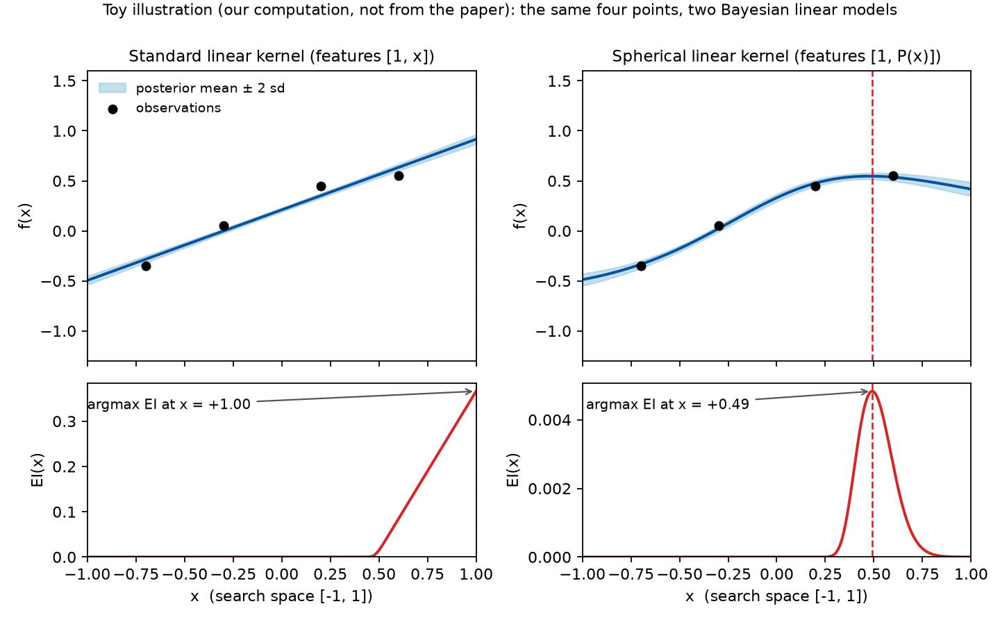

# Group note: "We Still Don't Understand High-Dimensional Bayesian Optimization"

**Paper:** Colin Doumont, Donney Fan, Natalie Maus, Jacob R. Gardner, Henry Moss, Geoff Pleiss. *We Still Don't Understand High-Dimensional Bayesian Optimization.* arXiv:2512.00170v2 (cs.LG), 9 Apr 2026. Code: https://github.com/colmont/linear-bo.

**Who this is for:** people who know BO and GPs but have not read the paper. Section 6 separates what the paper says from my own reading.

---

## TL;DR

The paper takes the "smoother priors for higher D" idea behind Vanilla BO (Hvarfner et al., 2024; Xu et al., 2025) to its end point: a GP with a **linear kernel**, i.e. Bayesian linear regression. A plain linear kernel does badly, and the authors prove why: with any acquisition function that increases in posterior mean and standard deviation (EI, UCB, ...), a Bayesian linear model always acquires on the boundary of the hypercube (Theorem 1). Their fix is geometric: map each (lengthscale-scaled) input onto the unit sphere $\mathbb{S}^D \subset \mathbb{R}^{D+1}$ with the inverse stereographic projection, then apply the linear kernel. With that one change, plus some hyperparameter hygiene, the linear model **matches** Vanilla BO and the specialised HDBO baselines (TuRBO, SAASBO, BAxUS, BOCK) on six benchmarks from $D = 60$ to $D = 6392$ with $N = 1000$ evaluations, and **beats** the scalable variational baseline (EULBO) on molecular tasks with $N = 20{,}000$ in a 256-D latent space, where its $O(ND^2)$ exact inference is a real advantage.

The title is not false modesty. The analysis section shows that the spherical mapping barely changes the model for typical points in high dimensions (it is nearly the identity on unit-norm inputs, and almost all scaled inputs have unit norm), that the mapped and unmapped linear models have the same regression accuracy on random test points, and yet one works for BO and the other does not. The authors' conclusion is that expressiveness and generalisation on random data do not predict BO performance, and that we lack a theory of what does.

---

## 1. Where the paper sits

The classical picture of HDBO (Section 2.2 of the paper): regret bounds for GP-BO with universal kernels grow exponentially in $D$ (Srinivas et al., 2010; Bull, 2011), so practical methods reduce effective complexity by assuming additive structure (Kandasamy et al., 2015), sparsity or low-dimensional embeddings (Eriksson and Jankowiak, 2021; Papenmeier et al., 2022), or by searching locally in trust regions (Eriksson et al., 2019).

Hvarfner et al. (2024) and Xu et al. (2025) upset this picture. They showed that the "vanilla" recipe, EI with an RBF GP, is competitive up to $D > 6000$ once the lengthscales are scaled by $\sqrt{D}$ (so that the expected norm of scaled inputs does not grow with $D$). This works even in the regime the paper calls $N \approx D$, where there are not enough observations to fit even a first-order Taylor expansion at a single point.

Doumont et al. ask: if what helps is a prior that favours smoother functions as $D$ grows, what happens if we go all the way to the smoothest non-constant functions, i.e. linear ones? You cannot get there by scaling lengthscales faster than $\sqrt{D}$ (that collapses the RBF prior to constant functions, Section 3), so they switch kernels instead. Note that standard references (Garnett, 2023; Shahriari et al., 2015) explicitly discourage linear kernels for BO, and the paper's own Figure 2 confirms that the naive linear kernel fails on most tasks.

---

## 2. What the paper claims

1. **Boundary-seeking is the pathology of linear models in BO, and it is provable** (Theorem 1, Section 3.1, proof in Appendix A.1).
2. **Mapping inputs to a sphere removes it**, and the resulting "spherical linear kernel" matches state-of-the-art HDBO performance for $N \approx D$ on standard benchmarks from 60 to 6392 dimensions (Section 4.1).
3. **For $N \gg D$ the linear model is the practical choice**: exact inference in $O(ND^2)$, exact Thompson samples, and substantially better optimisation than variational GP approximations on $N = 20{,}000$ molecular tasks (Sections 3.3, 4.2).
4. **Adding capacity does not help**: higher-order polynomial kernels on the sphere, which can approximate the RBF kernel arbitrarily well, perform no better than the linear one (Section 4.3).
5. **Our understanding of HDBO is incomplete**: the spherical mapping is geometrically minor and adds no measurable regression accuracy, yet it is decisive for BO, so "model expressiveness does not predict BO performance" (Section 5).

---

## 3. The method

### 3.1 The kernel

Everything happens on the centred hypercube $\mathcal{X} = [-1, 1]^D$. The proposed kernel (Eq. 2) is

$$k(\mathbf{x}, \mathbf{x}') = b_0 + b_1\, P(\mathbf{z})^\top P(\mathbf{z}'), \qquad \mathbf{z} = \tfrac{1}{a}\big[x_1/\ell_1, \ldots, x_D/\ell_D\big],$$

where $P : \mathbb{R}^D \to \mathbb{S}^D$ is the inverse stereographic projection (Eq. 4):

$$P(\mathbf{z}) = \frac{1}{\|\mathbf{z}\|^2 + 1}\Big[\,2z_1, \ldots, 2z_D,\ \|\mathbf{z}\|^2 - 1\,\Big].$$

So this is Bayesian linear regression on $D + 1$ features, with the features being the sphere coordinates of the scaled input. Three further design choices (all in Section 3.1):

- **Decoupled lengthscale.** A single global scale $a$, initialised at $O(\sqrt{D})$, multiplies a per-dimension ARD vector $\boldsymbol{\ell}$ with a log-normal prior $\ell_i \sim \mathcal{LN}(\sqrt{2}, \sqrt{3})$. The $\sqrt{D}$ scaling makes entries of $\mathbf{z}$ $O(1/\sqrt{D})$, so $\|\mathbf{z}\| = O(1)$ before projection. This replaces the dimension-dependent prior of Hvarfner et al. (2024).
- **No implicit outputscale.** Since $P$ maps onto the unit sphere, $P(\mathbf{z})^\top P(\mathbf{z}') \le 1$ with equality iff $\mathbf{x} = \mathbf{x}'$, so the kernel is bounded by $b_0 + b_1$ like an RBF kernel. They enforce $b_0 + b_1 = 1$ via a softmax parameterisation.
- **Polynomial extension (Section 3.2).** $k_{\text{poly}} = \sum_{i=0}^{m} b_i [P(\mathbf{z})^\top P(\mathbf{z}')]^i$, coefficients on the simplex. By Schoenberg (1942) any dot-product kernel on the sphere has this form, and Appendix A.3 shows any isotropic kernel restricted to the sphere is a convergent series of this form; e.g. the RBF kernel on the sphere is $\sum_i \frac{1}{i!\,e}[P(\mathbf{z})^\top P(\mathbf{z}')]^i$ (Eq. 6). So $m$ interpolates between "linear" and "RBF on the sphere". This is what makes the ablation in Section 4.3 meaningful.

### 3.2 Why the sphere: Theorem 1 and its escape

**Theorem 1.** For any acquisition function increasing in posterior mean and standard deviation, a Bayesian linear model on $[-1, 1]^D$ maximises acquisition at a point with $\|\mathbf{x}_{t+1}\|_\infty = 1$, i.e. at least one coordinate on the boundary.

The proof (Appendix A.1) is two lines: write $\mathbf{x} = c\,\mathbf{z}$ with $\|\mathbf{z}\| = 1$; then $\mu(\mathbf{x}) = c\, \mathbf{z}^\top\hat{\boldsymbol{\beta}}$ and $\sigma(\mathbf{x}) = \sqrt{\sigma_\varepsilon^2 + c^2\, \mathbf{z}^\top \mathbf{S}\mathbf{z}}$ are both non-decreasing in $c$ (after flipping $\mathbf{z}$ so that $\mathbf{z}^\top\hat{\boldsymbol{\beta}} \ge 0$), so any interior point can be improved by moving outward. With an intercept the same argument works along rays from a shifted centre $\mathbf{x}_0$. Empirically it is worse than the theorem says: Figure 5 (left) shows the standard linear kernel acquires points with 100% of coordinates at $\pm 1$ on MOPTA08 and SVM, i.e. it searches only the $2^D$ corners.

On the sphere there is no "outward": all feature vectors have unit norm, so scaling cannot raise the acquisition. Appendix A.2 gives an explicit 1-D counterexample where UCB with $\lambda = 0$ under the stereographic features is maximised at the interior point $x = 1/2$.

*Figure A (our own toy computation, not from the paper; script `fig_boundary_seeking.py` in this directory). The same four synthetic observations are fit with Bayesian linear regression on features $[1, x]$ (left) and on $[1, P(x)]$ with the inverse stereographic $P$ (right). Top: posterior mean and $\pm 2$ sd. Bottom: expected improvement. On the left EI is monotone and its maximiser is pinned to the boundary $x = +1$, as Theorem 1 says; on the right the sphere features let the posterior bend and EI peaks in the interior at $x \approx 0.49$, as in the paper's Appendix A.2 counterexample.*

### 3.3 Why linear is attractive if it works (Section 3.3)

- Exact posterior inference in $O(ND^2)$ time instead of $O(N^3)$, since the model has $D + 1$ weights (Williams and Rasmussen, 2006). For the molecular tasks this means exact GP inference at $N > 20{,}000$, where RBF/Matérn GPs need variational or inducing-point approximations.
- Exact Thompson sampling: a posterior function is $f(\mathbf{x}) = \theta_0 + \boldsymbol{\theta}^\top P(\mathbf{z})$ with Gaussian $(\theta_0, \boldsymbol{\theta})$, so sampling weights gives an exact pathwise sample. Non-degenerate kernels require approximations (they use Wilson et al., 2020 for the baselines in Appendix D.4).

---

## 4. How the claims are supported

### 4.1 Experimental setup (Section 4, Appendix C)

| Regime | Tasks | $D$ | $N$ | Baselines |
|---|---|---|---|---|
| $N \approx D$ | Rover, MOPTA08, Lasso-DNA, SVM, Ant, Humanoid | 60, 124, 180, 388, 888, 6392 | 1000 (30 Sobol init) | BOCK, TuRBO, SAASBO, BAxUS, Vanilla BO, standard linear kernel, Sobol random search |
| $N \gg D$ | GuacaMol molecular objectives in the 256-D latent space of a pretrained SELFIES-VAE (Maus et al., 2022) | 256 | 20,000 (100 init) | EULBO (Maus et al., 2024), a variational-GP method |

Protocol follows Hvarfner et al. (2024): LogEI acquisition (Ament et al., 2023), at least 10 seeds, plots show mean $\pm$ standard error. SAASBO was run for only 500 iterations because of cost. Runtimes of the linear kernel and Vanilla BO are similar ($\pm 10\%$): 1 to 12 GPU-hours per $N = 1000$ run, 4 to 6 days per molecular run. Implementations: BoTorch for TuRBO/SAASBO/Vanilla BO, authors' code for EULBO and BAxUS, a GPyTorch re-implementation of BOCK.

All headline results are reported as curves (Figure 2 and appendix figures); the text gives no final numbers, so I quote the authors' verbal summaries below and not values.

### 4.2 Main results

- **$N \approx D$ (Section 4.1, Figure 2 left).** The standard linear kernel fails on most tasks (decent on the lower-dimensional ones), while the spherical linear kernel "matches the current state-of-the-art on all" six benchmarks; on Lasso-DNA and Humanoid its trajectory is "statistically indistinguishable" from Vanilla BO. The gap between standard and spherical linear kernels is largest on SVM and Ant.
- **$N \gg D$ (Section 4.2, Figure 2 right).** "Significant performance gains" over EULBO on the molecular tasks. The authors attribute this to not needing posterior approximations, despite the low capacity.
- **Latent-space tasks at $N = 1000$ (Appendix E.1, Figure 13).** On nine GuacaMol objectives in the same 256-D latent space, the spherical linear kernel "significantly outperforms Vanilla BO on all nine datasets". The authors flag this as unexplained and worth follow-up.

### 4.3 Ablations (Section 4.3, Appendix D)

- **Polynomial order** $m = 1$ vs up to $m = 5$ (Figures 3, 14): "almost no effect"; MOPTA08 is the one minor exception where higher order helps slightly. Higher $m$ costs the $O(D)$ feature map and therefore the scalability and exact sampling, so it is "net detrimental".
- **Choice of sphere map** (Figures 4, 15): a sphere map is necessary, but which one matters a lot. Plain normalisation $\mathbf{z}/\|\mathbf{z}\|$ reaches state-of-the-art on Ant but is worse than *no* projection on MOPTA08. Inverse stereographic is consistently best. The authors note it is the only candidate that leaves unit-norm inputs unchanged ($P(\mathbf{z}) = [\mathbf{z}, 0]$ when $\|\mathbf{z}\| = 1$) and hypothesise this is why.
- **Components** (Appendix D.3, Figure 8): projection and centring the box at the origin are the key ingredients; ARD and the global lengthscale $a$ give only modest gains. Centring matters because $P$ depends on $\|\mathbf{x}\|$, so on $[0, 1]^D$ the two faces of the box would be treated differently.
- **Hyperprior** (Appendix D.1, Figure 7): the linear model is insensitive to the lengthscale prior (Gamma vs log-normal give identical curves), whereas the standard RBF GP is sensitive, consistent with Hvarfner et al. (2024).
- **Sphere map on RBF** (Appendix D.2): applying the same projection to an RBF kernel leaves Vanilla BO performance essentially unchanged. The mapping is decisive for linear models only.
- **Acquisition** (Appendix D.4, Figures 9, 10): UCB behaves like EI. Thompson sampling degrades both the linear model and Vanilla BO, but the linear model still matches or slightly beats Vanilla BO under TS.
- **Problem structure** (Appendix D.5, Figures 11, 12): embedding Hartmann-6 and Levy-4 in $D = 25$ to $1000$ ambient dimensions, the gap to Vanilla BO vanishes as $D$ grows. For GP-sampled objectives with kernel $\alpha\, k_{\text{linear}} + (1 - \alpha)\, k_{\text{RBF}}$, the gap shrinks from about 30% at $\alpha = 0$ (fully non-linear) to about 5% at $\alpha = 1$; the linear model still makes "substantial optimization progress" at $\alpha = 0$.

### 4.4 Analysis (Section 5)

This is the part that justifies the title. It presents two observations that pull in opposite directions.

**(a) The spherical linear kernel behaves like an RBF GP during BO** (Section 5.1, Figure 5, Appendix E.4-E.5).
- *Boundary percentage*: fraction of coordinates of each acquired point equal to $\pm 1$. Standard linear: ~100% (corners). RBF: $\le 50\%$. Spherical linear: similar to RBF, including fully interior points (0%) on SVM and Ant, and $> 50\%$ on the other four tasks.
- *Observation Traveling Salesman Distance* (OTSD; Papenmeier et al., 2025a): length of the shortest tour through all acquired points, a proxy for locality. Standard linear often exceeds random search (corners are maximally far apart, and this grows with $D$); spherical linear and RBF have similarly low OTSD, i.e. both search locally.

**(b) But the mapping is almost nothing** (Section 5.2, Appendix A.5). With lengthscales $\sqrt{3/D}$, a uniform $\mathbf{x} \in [-1, 1]^D$ gives $\mathbb{E}\|\mathbf{z}\|^2 = 1$ and $\operatorname{var}\|\mathbf{z}\|^2 = 4/(5D)$, so $\|\mathbf{z}\| \to 1$ (the thin-shell phenomenon; Vershynin, 2025). On unit-norm inputs $P$ is the identity up to one zero coordinate. So for most of the search space the spherical and standard linear models coincide, and the extra feature is a $< 1\%$ increase in dimension for most benchmarks. Empirically (Figure 6 left, Figure 18): trained on 400 Sobol points and tested on 100 held-out Sobol points, spherical and standard linear models have nearly identical RMSE, both worse than RBF.

**(c) Resolution offered: expressiveness is the wrong lens** (Section 5.3). When the same test is run on adaptively chosen data (fit to 400 points of a BO trajectory generated by the spherical linear model, predict the next 100 acquisitions), all three models, spherical linear, standard linear, and RBF, predict about equally well (Figure 6 right). The authors' tentative explanation: EI-type acquisitions select locally (Garnett, 2023), where a first-order Taylor model is adequate even for globally complex objectives. They say outright that "fully characterizing which properties actually matter for HDBO success ... remains an important open question" and that complete characterisation of the exploration behaviour "remains future work".

---

## 5. What the paper leaves open (the authors' own list)

- A theory of why spherical linear kernels work: Section 5 opens by saying the analysis "cannot resolve this puzzle".
- Why the inverse stereographic projection beats other sphere maps; the identity-on-the-unit-sphere property is a hypothesis.
- Why the linear model beats Vanilla BO so clearly in VAE latent spaces (Appendix E.1): "we leave more thorough analysis ... to further work".
- A characterisation of the exploration pattern beyond the two proxies (boundary %, OTSD).
- Which model properties predict BO performance, given that regression accuracy on random points does not.

---

## 6. My reading: caveats and questions for discussion

These are my own observations, not claims from the paper.

1. **"Outperforms" vs "matches".** The abstract says existing methods "are outperformed" by linear regression. In the $N \approx D$ experiments the text says *matches*, and for two tasks *statistically indistinguishable from Vanilla BO*. The genuine wins are (i) $N \gg D$ against a single scalable baseline, EULBO, and (ii) the latent-space tasks against Vanilla BO alone. Read the headline as: linear joins the top tier on standard benchmarks at lower cost, and wins where exact inference at large $N$ matters.

2. **Only one large-$N$ baseline.** EULBO is a variational method with its own approximations. The claim that linear beats "existing scalable approaches" (SVGP-style methods are cited in the introduction) rests on one comparison. A natural check: exact-GP-on-a-subset, or inducing-point methods tuned for BO (Moss et al., 2023; Vakili et al., 2021, which the paper cites but does not run).

3. **Everything with $\sqrt{D}$ scaling ties.** Appendix D.1-D.2 shows RBF-on-sphere with the global lengthscale also matches Vanilla BO and is also prior-insensitive. So on $N \approx D$, spherical linear, RBF, and RBF-on-sphere are all about equal. That strengthens the paper's "capacity is irrelevant here" message, but it also means the practical argument for linear on these tasks is cost and robustness, not optimisation quality.

4. **The thin-shell argument is about uniform points, BO data are not uniform.** Section 5.2 says the mapping is minor "except at the boundary", but acquisitions do land on or near boundaries ($> 50\%$ of coordinates on four of six tasks, Appendix E.4). So the region where the mapping is *not* negligible is exactly where the optimiser spends its time. This does not contradict the paper, but it suggests the "geometrically minor" framing understates the mapping's effect along BO trajectories, and might be a lead for the open theory question.

5. **The regression test in Section 5.3 is partly self-referential.** The adaptive test set is generated by the spherical linear model itself, so "linear predicts its own next acquisitions as well as RBF does" is a weaker statement than "linear predicts where BO needs it". Running the same test on trajectories generated by Vanilla BO would tighten it.

6. **Scope of the evidence.** Six continuous benchmarks plus one latent-space family; no discrete or mixed spaces, no noise study, nothing below $D = 60$, and SAASBO at half the budget. Appendix D.5 is the only controlled study of objective structure, and there the text reports the gap to Vanilla BO shrinking from 30% to 5% as the objective becomes linear, without the linear model pulling clearly ahead even on fully linear objectives (Figure 12). If a linear surrogate does not win on linear objectives, the mechanism behind its success is not "the surrogate matches the objective", which is worth a second look.

7. **What the theorem does and does not say.** Theorem 1 says the acquisition maximiser has at least one coordinate on the boundary; corner-seeking (all coordinates) is an empirical observation, and the paper's intuition for it (mean and variance both grow along every ray) is plausible but not proved. The theorem needs only monotonicity of $\alpha$ in $(\mu, \sigma)$, so it covers EI, LogEI and UCB; it does not cover Thompson sampling or entropy-based acquisitions (nor PI, which is decreasing in $\sigma$ once $\mu$ exceeds the incumbent). For TS the conclusion holds anyway: a sample from a standard linear model is a linear function, and a linear function on a box is maximised at a vertex.

8. **Title context.** The title reads as a reply to Papenmeier et al. (2025b), "Understanding High-Dimensional Bayesian Optimization", which the paper cites among the $\sqrt{D}$-scaling works. Worth reading the two together.

**Questions I would raise at group meeting:** Is "local linear + exact inference" the whole story for the $N \gg D$ wins, and if so, does a Matérn GP with exact inference on a local subset close the gap? Would the sphere mapping help other degenerate kernels (e.g. random Fourier features at small width)? And does the boundary-percentage pattern (interior on SVM/Ant, boundary elsewhere) track something measurable about the objectives?

---

## References

All of the following are cited as given in the paper's reference list; I rely on the paper's descriptions of them.

- Ament, S., Daulton, S., Eriksson, D., Balandat, M., Bakshy, E. (2023). Unexpected improvements to expected improvement for Bayesian optimization. *NeurIPS*.
- Bull, A. D. (2011). Convergence rates of efficient global optimization algorithms. *JMLR*.
- Doumont, C., Fan, D., Maus, N., Gardner, J. R., Moss, H., Pleiss, G. (2025). We still don't understand high-dimensional Bayesian optimization. arXiv:2512.00170v2.
- Eriksson, D., Jankowiak, M. (2021). High-dimensional Bayesian optimization with sparse axis-aligned subspaces. *UAI*. (SAASBO)
- Eriksson, D., Pearce, M., Gardner, J., Turner, R. D., Poloczek, M. (2019). Scalable global optimization via local Bayesian optimization. *NeurIPS*. (TuRBO)
- Garnett, R. (2023). *Bayesian Optimization*. Cambridge University Press.
- Hvarfner, C., Hellsten, E. O., Nardi, L. (2024). Vanilla Bayesian optimization performs great in high dimensions. *ICML*.
- Kandasamy, K., Schneider, J., Póczos, B. (2015). High dimensional Bayesian optimisation and bandits via additive models. *ICML*.
- Maus, N., Jones, H., Moore, J., Kusner, M. J., Bradshaw, J., Gardner, J. (2022). Local latent space Bayesian optimization over structured inputs. *NeurIPS*.
- Maus, N., Kim, K., Pleiss, G., Eriksson, D., Cunningham, J. P., Gardner, J. R. (2024). Approximation-aware Bayesian optimization. *NeurIPS*. (EULBO)
- Moss, H. B., Ober, S. W., Picheny, V. (2023). Inducing point allocation for sparse Gaussian processes in high-throughput Bayesian optimisation. *AISTATS*.
- Oh, C., Gavves, E., Welling, M. (2018). BOCK: Bayesian optimization with cylindrical kernels. *ICML*.
- Papenmeier, L., Nardi, L., Poloczek, M. (2022). Increasing the scope as you learn: Adaptive Bayesian optimization in nested subspaces. *NeurIPS*. (BAxUS)
- Papenmeier, L., Cheng, N., Becker, S., Nardi, L. (2025a). Exploring exploration in Bayesian optimization. *UAI*. (OTSD)
- Papenmeier, L., Poloczek, M., Nardi, L. (2025b). Understanding high-dimensional Bayesian optimization. *ICML*.
- Schoenberg, I. (1942). Positive definite functions on spheres. *Duke Mathematical Journal*.
- Shahriari, B., Swersky, K., Wang, Z., Adams, R. P., De Freitas, N. (2015). Taking the human out of the loop: A review of Bayesian optimization. *Proceedings of the IEEE*.
- Srinivas, N., Krause, A., Kakade, S. M., Seeger, M. (2010). Gaussian process optimization in the bandit setting. *ICML*.
- Vakili, S., Moss, H., Artemev, A., Dutordoir, V., Picheny, V. (2021). Scalable Thompson sampling using sparse Gaussian process models. *NeurIPS*.
- Vershynin, R. (2025). *High-Dimensional Probability*, 2nd ed. Cambridge University Press.
- Williams, C. K., Rasmussen, C. E. (2006). *Gaussian Processes for Machine Learning*. MIT Press.
- Wilson, J., Borovitskiy, V., Terenin, A., Mostowsky, P., Deisenroth, M. (2020). Efficiently sampling functions from Gaussian process posteriors. *ICML*.
- Xu, Z., Wang, H., Phillips, J. M., Zhe, S. (2025). Standard Gaussian process is all you need for high-dimensional Bayesian optimization. *ICLR*.
