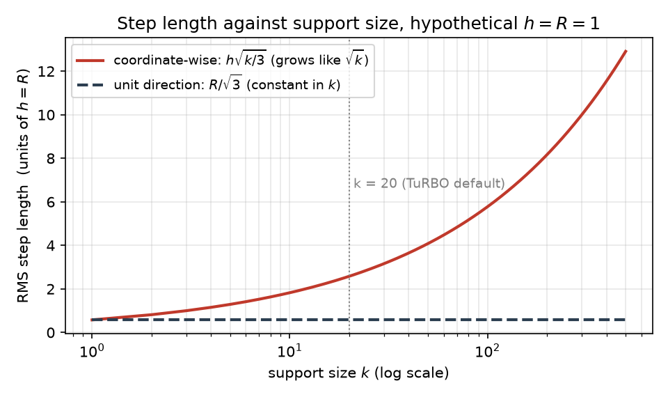
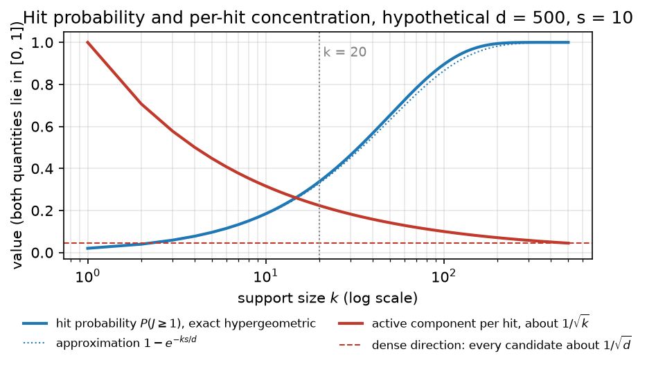

### 6.1 The generator, and what $k$ means

This section defines the sparse candidate generator and fixes what its one new parameter, the support size $k$, does and does not control. Two existing generators serve as reference points: CTS, the generator this plan builds on (§2), and RAASP, the perturbation scheme used in TuRBO.

**CTS.** CTS generates a candidate by stepping from the incumbent $c$ (the best point found so far) in a random direction $v$ by a random distance $r$:

$$
x = c + r v, \qquad r \sim U(0, R), \qquad \lVert v \rVert_2 = 1,
$$

The direction $v$ is dense: every coordinate can be nonzero. The distance $r$ is drawn independently of the direction. Two safeguards keep candidates sensible near the domain boundary. First, CTS draws $v$ from a truncated multivariate normal, so that a dense random direction does not point into a nearby wall. Second, it caps the permissible radius by both the wall distance and a trust-region-like $R_{\max}$. (LITERATURE CONTEXT TO VERIFY: the exact construction, Rashidi, Johnstonbaugh & Gao 2024.)

**RAASP.** RAASP works coordinate by coordinate instead. For each coordinate it decides whether to perturb it; in the original TuRBO implementation the probability is $\min(1, 20/d)$. The perturbed coordinates take their values from Sobol points inside the rectangular trust region, and the other coordinates stay where they are. So for $d \gg 20$, about 20 coordinates move in each candidate.

**The sparse construction.** The sparse generator sits between these two. It

1. chooses a support $S \subseteq \{1, \ldots, d\}$ with $\lvert S \rvert = k$, the set of coordinates allowed to move;
2. sets $v_i = 0$ for $i \notin S$;
3. draws the direction on $S$ and the radius $r$ exactly as CTS does.

The support size then interpolates between the reference generators: $k = 1$ is a coordinate-like move, $1 < k < d$ is a sparse move, and $k = d$ is ordinary CTS in the interior (§2).

One point needs stating now because the rest of the thread depends on it. $k$ is an **angular support dimension**: it says how many coordinates the direction $v$ may involve. It is not a distance; the distance is set separately by $r$. FACT.

### 6.2 Why RAASP's "20" cannot be inherited

A natural first instinct is to reuse RAASP's value: TuRBO moves about 20 coordinates, so set $k = 20$. This section explains why that number does not transfer. In a coordinate-wise sampler, support size and step length are coupled. In the unit-direction construction of §6.1, they are not.

**Coordinate-wise perturbation couples $k$ and distance.** Take a simplified model of RAASP: each of the $k$ perturbed coordinates is displaced independently by $\delta_i \sim U(-h, h)$. A uniform draw on $[-h, h]$ has second moment $\mathbb{E}[\delta_i^2] = h^2 / 3$, and summing over the $k$ moving coordinates gives

$$
\mathbb{E}\lVert \delta \rVert_2^2 = \frac{k h^2}{3},
$$

so the typical step length grows like $\sqrt{k}$. As a hypothetical instance with $h = 1$: at $k = 1$ the root-mean-square step is $1/\sqrt{3} \approx 0.58$, and at $k = 20$ it is $\sqrt{20/3} \approx 2.58$, about 4.5 times longer. Increasing $k$ therefore changes *how many coordinates move* and *how far the candidate moves* at once.

This is a FACT about the simplified model, not a claim about every RAASP implementation. It matters for two reasons. It is one reason sparsity helps RAASP stay local: fewer moving coordinates means shorter steps. And it means the TuRBO value 20 belongs to a sampler in which support size also sets distance, so the value carries a step-length choice with it.

**The unit-direction construction separates them.** In the sparse generator, $\delta = r v$ with $\lVert v \rVert = 1$, so

$$
\lVert \delta \rVert_2 = r
$$

exactly, whatever $k$ is. With $r \sim U(0, R)$ the mean squared step is $R^2 / 3$ for every $k$ (FACT, in the interior, where the radius cap of §6.1 does not shorten $r$). The two controls are then separate: $k$ is how many coordinates cooperate, and $r$ is how far the move goes. In the same hypothetical, $k = 1$ and $k = 20$ both have root-mean-square step $R/\sqrt{3}$.

*Figure 1. Illustration of the two step-length formulas above, not measured data, with hypothetical scale $h = R = 1$. The solid red curve is the coordinate-wise model, $h\sqrt{k/3}$; the dashed dark curve is the unit-direction construction, $R/\sqrt{3}$. Read left to right as $k$ grows: the red curve rises like $\sqrt{k}$ while the dashed curve stays flat, so only the coordinate-wise sampler changes its step length when $k$ changes. The dotted vertical line marks $k = 20$, the TuRBO default.*

**The first hypothesis.** HYPOTHESIS (the thread's first): some of the effect commonly attributed to sparse perturbations is due to the support size itself, rather than to the shorter steps that coordinate-wise sparsity produces.

The test is to hold the radial law fixed, so that $r$ has the same distribution for every $k$, and sweep $k$. If the differences between $k$ values disappear under this radial control, the hypothesis is weakened.

### 6.3 What a random support does

The sparse generator picks its $k$ coordinates at random. This section asks what that does to a candidate, in a setting chosen for analysis only: an axis-aligned objective that depends on an active set $A$ of $\lvert A \rvert = s$ coordinates, with the support $S$ drawn uniformly among the $k$-subsets of $\{1, \ldots, d\}$. Two questions follow. How often does $S$ touch $A$ at all, and when it does, how much of the direction lands in $A$?

**Hit probability rises with $k$.** The overlap $J = \lvert S \cap A \rvert$ counts the active coordinates that happen to be in the support. It is hypergeometric, the distribution of the number of marked items when $k$ are drawn without replacement from $d$ items of which $s$ are marked:

$$
P(J = j) = \frac{\binom{s}{j} \binom{d - s}{k - j}}{\binom{d}{k}}, \qquad \mathbb{E}[J] = \frac{k s}{d},
$$

and for $s, k \ll d$ the chance of touching at least one active coordinate is about $1 - e^{-k s / d}$ (FACT). As a hypothetical instance, take $d = 500$, $s = 10$, and $k = 20$: then $\mathbb{E}[J] = 0.4$ and the hit chance is about $1 - e^{-0.4} \approx 0.33$, so roughly two candidates in three move no active coordinate at all. This is the familiar argument against very sparse supports. It is only half the story.

**Average active energy does not depend on $k$.** Let $P_A$ be the projection onto the active coordinates, so $\lVert P_A v \rVert^2$ is the fraction of the unit direction's squared length, its energy, that lies in the active subspace. Suppose the direction is isotropic on $S$: within the support, every direction is equally likely. Then conditional on $J = j$, the energy spreads evenly over the $k$ support coordinates and $j$ of them are active, so $\lVert P_A v \rVert^2$ has mean $j / k$. Averaging over supports gives

$$
\mathbb{E}\lVert P_A v \rVert^2 = \mathbb{E}\Big[ \frac{J}{k} \Big] = \frac{s}{d}
$$

for every $k$ (FACT under isotropy). Sparse and dense pools allocate the same *average* fraction of directional energy to an unknown active subspace. So the intuitive claim "smaller $k$ puts more energy into the active coordinates" is false on average. In the hypothetical instance, $k = 20$ and $k = 500$ both put $s/d = 2\%$ of their energy into $A$ on average.

**What changes is the distribution.** A dense direction gives every candidate a small active component, of size about $1 / \sqrt{d}$. A sparse direction gives most candidates none, and gives the rest a component of size about $1 / \sqrt{k}$. At $d = 500$ and $k = 20$ that is $1/\sqrt{500} \approx 0.045$ against $1/\sqrt{20} \approx 0.22$, a factor 5 larger. Sparse pools therefore trade hit probability, which rises with $k$, for concentration per hit, which rises as $k$ falls.

*Figure 2. Illustration of the formulas in this section, not measured data, with hypothetical $d = 500$ and $s = 10$. The solid blue curve is the exact hypergeometric hit probability $P(J \geq 1)$; the dotted blue curve is the approximation $1 - e^{-ks/d}$. The solid red curve is the per-hit active component, about $1/\sqrt{k}$, and the dashed red line is the dense reference $1/\sqrt{d}$. Read left to right as $k$ grows: the blue curve rises toward 1 while the red curve falls toward the dashed line. Compare the two at any $k$ to see the trade: small $k$ hits rarely but concentrates each hit far above the dense level, and large $k$ hits almost always but no harder than a dense direction.*

Because the optimizer then takes the best candidate of a pool of $M$, what matters is the top of the pool rather than its typical member. This is an extreme-value question, and the pool size $M$ is part of the answer. HYPOTHESIS: rare strong hits beat ubiquitous weak hits when the pool is large enough and the selector can find them.

Two parts of the plan address this hypothesis. Step 0 (§4) makes it quantitative under the linear model. The tail diagnostic of Step 3 measures it: the distribution, per $k$, of the active-space displacement $D_A = \lVert P_A (x - c) \rVert$, with its mass at zero (candidates that miss $A$) and its upper quantiles (the strong hits).
