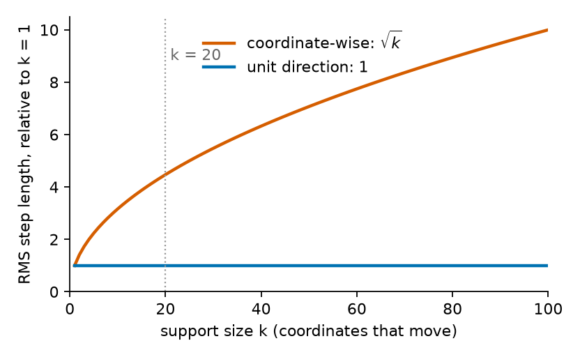
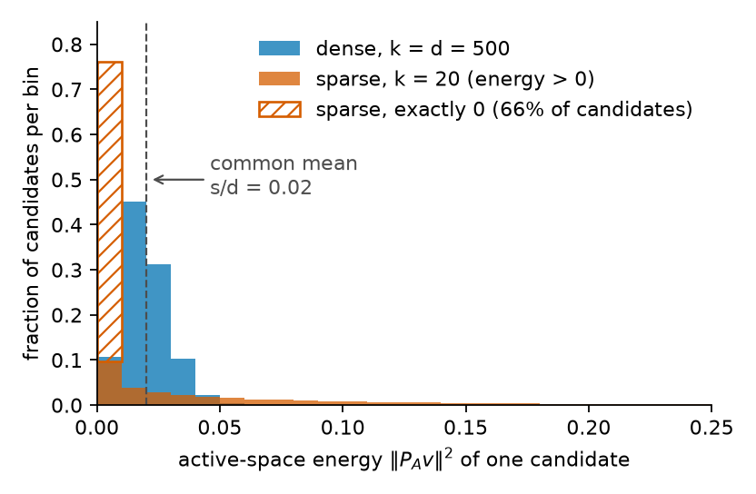

### 6.1 The generator, and what $k$ means

This section defines the candidate generator used in this study and fixes what its parameter $k$ means. Two existing samplers frame the construction: CTS, which moves along a dense random direction, and RAASP, which moves a handful of coordinates at a time. Our generator sits between them.

**CTS.** CTS generates a candidate by stepping from the incumbent $c$ (the best point found so far) along a direction $v$ by a distance $r$:

$$
x = c + r v, \qquad r \sim U(0, R), \qquad \lVert v \rVert_2 = 1,
$$

Here $v$ is a dense direction, so every coordinate can change, and $r$ is a distance drawn independently of $v$. Because $v$ has unit length, $r$ is exactly how far the candidate moves.

Two details handle the boundary of the domain. CTS draws $v$ from a truncated multivariate normal, so that a dense random direction does not point into a nearby wall. It also caps the permissible radius by both the distance to the wall and a trust-region-like $R_{\max}$. (LITERATURE CONTEXT TO VERIFY: the exact construction, Rashidi, Johnstonbaugh & Gao 2024.)

**RAASP.** RAASP works coordinate by coordinate. For each coordinate it decides whether to perturb it, with probability $\min(1, 20/d)$ in the original TuRBO implementation. The perturbed coordinates are filled from Sobol points inside the rectangular trust region. For $d \gg 20$, about 20 coordinates move in each candidate.

**The sparse construction.** Choose a support $S \subseteq \{1, \ldots, d\}$ with $\lvert S \rvert = k$, set $v_i = 0$ for $i \notin S$, and draw the direction on $S$ and the radius as CTS does. The support size $k$ then interpolates between the two samplers:

- $k = 1$ is a coordinate-like move.
- $1 < k < d$ is a sparse move.
- $k = d$ is ordinary CTS in the interior (§2).

One point to hold onto for the rest of this section: $k$ is an **angular support dimension**, the number of coordinates that share the direction. It is not a distance. FACT.

### 6.2 Why RAASP's "20" cannot be inherited

RAASP's default of about 20 moving coordinates looks like a natural value for $k$. This subsection argues that the number does not transfer, because in a coordinate-wise sampler the support size also sets the step length, while in our construction it does not.

**Coordinate-wise perturbation couples support size to distance.** Consider a simplified model of a RAASP-style move: each of the $k$ perturbed coordinates is displaced independently by $\delta_i \sim U(-h, h)$. Each displaced coordinate contributes $\mathbb{E}[\delta_i^2] = h^2 / 3$ to the squared step, and the contributions add:

$$
\mathbb{E}\lVert \delta \rVert_2^2 = \frac{k h^2}{3},
$$

so the typical step grows like $\sqrt{k}$. As a hypothetical instance, moving 20 coordinates gives a root-mean-square step about $\sqrt{20} \approx 4.5$ times longer than moving one. Increasing $k$ therefore changes *how many coordinates move* and *how far the candidate moves* at once.

This is a FACT about the simplified model, not a claim about every RAASP implementation. It matters in two ways. It is one reason sparsity helps RAASP stay local: fewer moving coordinates means a shorter step. And it is why the TuRBO value 20 belongs to a sampler in which support size also sets distance. In such a sampler, choosing 20 coordinates also chooses a step scale.

**The unit-direction construction separates them.** In our construction, $\delta = r v$ with $\lVert v \rVert = 1$ gives

$$
\lVert \delta \rVert_2 = r
$$

exactly. With $r \sim U(0, R)$, the mean squared step is $R^2 / 3$ for every $k$ (FACT, in the interior). Whether one coordinate moves or all $d$ of them, the step length has the same distribution. The two controls are therefore separate: $k$ is how many coordinates cooperate, and $r$ is how far the move goes. Figure 1 shows the contrast.

*Figure 1. Illustration computed from the two models in this subsection, not measured data. Each line is the root-mean-square step length as a function of the support size $k$, divided by its value at $k = 1$. Orange: the coordinate-wise model, $\mathbb{E}\lVert \delta \rVert_2^2 = k h^2 / 3$, which grows like $\sqrt{k}$. Blue: the unit-direction construction, $\lVert \delta \rVert_2 = r$, which does not depend on $k$. Read left to right: as more coordinates move, the coordinate-wise step lengthens and the unit-direction step does not. The dotted line marks RAASP's $k = 20$.*

**The first hypothesis of this thread.** Because our construction separates the two controls, it can test them apart. HYPOTHESIS (the thread's first): some of the effect commonly attributed to sparse perturbations is due to the support size itself, rather than to the shorter steps that coordinate-wise sparsity produces. The test is to hold the radial law fixed and sweep $k$. If the differences between support sizes disappear under radial control, the hypothesis is weakened.

### 6.3 What a random support does

Section 6.2 fixed the step length. This subsection asks what a random support of size $k$ does to the *direction*: how much of it lands in the coordinates that matter.

The analysis uses a model, for analysis only. Take an axis-aligned objective that depends on an active set $A$ of coordinates, with $\lvert A \rvert = s$, and a support $S$ drawn uniformly among the $k$-subsets of $\{1, \ldots, d\}$. The optimizer does not know $A$, so $S$ may or may not touch it.

**Hit probability rises with $k$.** The overlap $J = \lvert S \cap A \rvert$ counts how many active coordinates the support touches. Because $S$ is a uniform random subset, $J$ is hypergeometric:

$$
P(J = j) = \frac{\binom{s}{j} \binom{d - s}{k - j}}{\binom{d}{k}}, \qquad \mathbb{E}[J] = \frac{k s}{d},
$$

and for $s, k \ll d$ the chance of touching at least one active coordinate is about $1 - e^{-k s / d}$ (FACT). As a hypothetical instance, with $d = 500$, $s = 10$ and $k = 20$ that chance is about $1 - e^{-0.4} \approx 0.33$, so roughly two candidates in three move no active coordinate at all. This is the familiar argument against very sparse supports, and it is only half the story.

**Average active-space energy does not depend on $k$.** Write $P_A$ for the projection onto the active coordinates. Since $v$ has unit length, $\lVert P_A v \rVert^2$ is the fraction of the direction's energy that lies in the active subspace. Suppose the direction is isotropic on $S$, meaning it has no preferred orientation within the support. Then each coordinate in $S$ carries $1/k$ of the energy on average, so conditional on $J = j$ the squared active-space energy $\lVert P_A v \rVert^2$ has mean $j / k$. Averaging over supports gives

$$
\mathbb{E}\lVert P_A v \rVert^2 = \mathbb{E}\Big[ \frac{J}{k} \Big] = \frac{s}{d}
$$

for every $k$ (FACT under isotropy). Sparse and dense pools allocate the same *average* fraction of directional energy to an unknown active subspace. The intuition that "smaller $k$ puts more energy into the active coordinates" is therefore false on average.

**What changes is the distribution.** The average hides where the energy goes:

- A dense direction ($k = d$) gives every candidate a small active component, of size about $1 / \sqrt{d}$ along an active coordinate.
- A sparse direction gives most candidates no active component at all, and the rest a component of size about $1 / \sqrt{k}$ along each active coordinate they touch.

At $d = 500$ and $k = 20$ the sparse component is a factor $\sqrt{500 / 20} = 5$ larger. Sparse pools therefore trade hit probability, which rises with $k$, for concentration per hit, which rises as $k$ falls. Figure 2 shows both faces of this trade at the hypothetical values above.

*Figure 2. Illustration sampled from the model in this subsection with hypothetical $d = 500$, $s = 10$ and 200 000 candidates per case; not measured data. Each bar is the fraction of candidates whose active-space energy $\lVert P_A v \rVert^2$ falls in a bin of width 0.01. Blue: a dense direction, $k = d$. Orange: a sparse support, $k = 20$; the hatched bar at zero is the 66% of sparse candidates that touch no active coordinate. The dashed line is the common mean $s / d = 0.02$. Compare the shapes, not the means: the dense candidates cluster near the mean, while the sparse candidates sit mostly at zero with a long tail to the right.*

**Why the pool size enters.** The optimizer does not use an average candidate; it takes the best candidate of a pool of $M$. What matters is then the upper tail of the pool, not its mean, so this is an extreme-value question, and the pool size $M$ is part of the answer. HYPOTHESIS: rare strong hits beat ubiquitous weak hits when the pool is large enough and the selector can find them.

Two parts of the plan address this hypothesis. Step 0 (§4) makes it quantitative under the linear model. The tail diagnostic of Step 3 measures it: the distribution of the active-space displacement $D_A = \lVert P_A (x - c) \rVert$ for each $k$, including its mass at zero and its upper quantiles.
