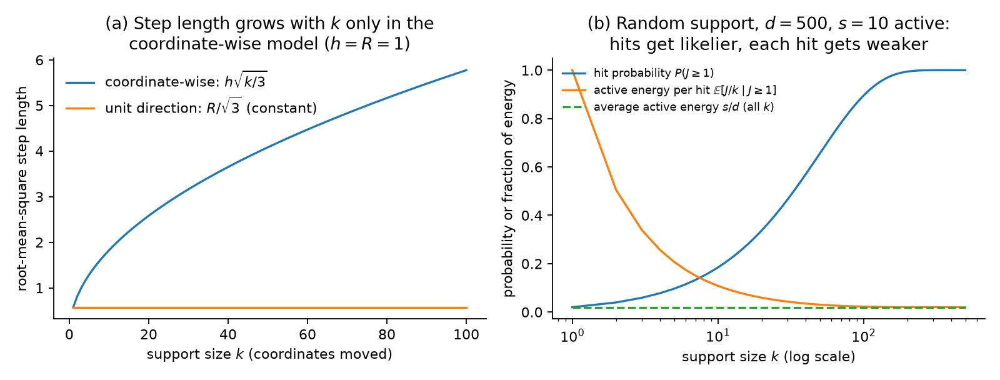

### 6.1 The generator, and what $k$ means

This section defines the candidate generator used in this study and the one parameter, $k$, that the later sections sweep. The sparse construction borrows one piece from each of two existing samplers, so it helps to see those two first.

**CTS.** CTS proposes a candidate $x$ by stepping from the incumbent $c$ (the best point found so far) along a random direction $v$ by a random distance $r$:

$$
x = c + r v, \qquad r \sim U(0, R), \qquad \lVert v \rVert_2 = 1,
$$

The direction $v$ is dense: every coordinate can be nonzero. The distance $r$ is drawn independently of $v$, uniformly between $0$ and a cap $R$. Two details keep the step inside the search domain. CTS draws $v$ from a truncated multivariate normal, so that a dense random direction does not point into a nearby wall of the domain. It also caps the permissible radius by both the distance to the wall and a trust-region-like maximum $R_{\max}$. (LITERATURE CONTEXT TO VERIFY: the exact construction, Rashidi, Johnstonbaugh & Gao 2024.)

**RAASP.** RAASP, the perturbation sampler in TuRBO, works coordinate by coordinate instead. It decides for each coordinate separately whether to perturb it; in the original TuRBO implementation, each coordinate moves with probability $\min(1, 20/d)$. The perturbed coordinates take their new values from Sobol points inside the rectangular trust region, and the others keep the incumbent's values. So for $d \gg 20$, about 20 coordinates move.

**The sparse construction.** The sampler studied here sits between the two. First choose a support $S \subseteq \{1, \ldots, d\}$, a set of exactly $k$ coordinates, so $\lvert S \rvert = k$. Set $v_i = 0$ for every coordinate $i \notin S$. Then draw the direction on $S$ and the radius $r$ exactly as CTS does. The support size $k$ now interpolates between the two existing samplers:

- $k = 1$ is a coordinate-like move, because only one coordinate changes;
- $1 < k < d$ is a sparse move;
- $k = d$ is ordinary CTS in the interior of the domain (§2).

One point to hold onto for the rest of the plan: $k$ is an **angular support dimension**, not a distance. It controls how many coordinates the direction $v$ involves. How far the candidate moves is set separately, by $r$. That is a FACT about the construction, and §6.2 explains why the distinction matters.

### 6.2 Why RAASP's "20" cannot be inherited

A natural first guess is to set $k = 20$, borrowing TuRBO's value. This section argues that the number does not transfer. In a coordinate-wise sampler the support size also controls the step length; in the unit-direction construction it does not.

**Step length in a coordinate-wise sampler.** Take a simplified model of a RAASP-style move: each of the $k$ perturbed coordinates is displaced independently by $\delta_i \sim U(-h, h)$, a uniform draw between $-h$ and $h$. The mean squared displacement of one coordinate is $\mathbb{E}[\delta_i^2] = h^2 / 3$, so the mean squared length of the whole step vector $\delta$ is

$$
\mathbb{E}\lVert \delta \rVert_2^2 = \frac{k h^2}{3},
$$

The typical step therefore grows like $\sqrt{k}$. As a hypothetical instance with $h$ fixed: moving 5 coordinates gives a root-mean-square step of about $1.3h$, and moving 20 coordinates gives about $2.6h$. Increasing $k$ changes *how many coordinates move* and *how far the candidate moves* at once.

This is a FACT about the simplified model, not a claim about every RAASP implementation. It has two consequences for us. It is one reason sparsity helps RAASP stay local: fewer perturbed coordinates means a shorter step. And it means that the TuRBO value 20 belongs to a sampler in which support size also sets distance, so it carries no direct meaning for a sampler in which it does not.

**Step length in the unit-direction construction.** In our construction the step is $\delta = r v$ with $\lVert v \rVert = 1$, so

$$
\lVert \delta \rVert_2 = r
$$

exactly. With $r \sim U(0, R)$, the mean squared step is $R^2 / 3$ for every $k$ (FACT, in the interior). Whether $v$ involves one coordinate or all $d$, the step length has the same distribution. The two controls are separate: $k$ is how many coordinates cooperate, and $r$ is how far the move goes. Figure 1(a) contrasts the two models.

**The first hypothesis.** This separation is what makes the thread's first hypothesis testable. HYPOTHESIS: some of the effect commonly attributed to sparse perturbations is due to the support size itself, rather than to the shorter steps that coordinate-wise sparsity produces. The test is to hold the radial law (the distribution of $r$) fixed and sweep $k$. If the differences between support sizes disappear under this radial control, the hypothesis is weakened.

### 6.3 What a random support does

Suppose the objective depends on only some of the coordinates, and we do not know which ones. This section asks what a randomly chosen support $S$ does to a candidate's chance of moving those coordinates, and how strongly it moves them. The analysis uses a deliberately simple model.

**The model.** For analysis only, take an axis-aligned objective that depends on an active set $A$ of coordinates, with $\lvert A \rvert = s$. Draw the support $S$ uniformly among all $k$-subsets of $\{1, \ldots, d\}$. The quantity of interest is the overlap $J = \lvert S \cap A \rvert$: the number of active coordinates that the support happens to include.

**Hit probability rises with $k$.** Because $S$ is a uniform random $k$-subset, $J$ follows a hypergeometric distribution:

$$
P(J = j) = \frac{\binom{s}{j} \binom{d - s}{k - j}}{\binom{d}{k}}, \qquad \mathbb{E}[J] = \frac{k s}{d},
$$

When $s$ and $k$ are both much smaller than $d$, the chance of touching at least one active coordinate is about $1 - e^{-k s / d}$ (FACT). As a hypothetical instance: with $d = 500$, $s = 10$ and $k = 20$, the expected overlap is $0.4$, and roughly one candidate in three touches any active coordinate at all. This is the familiar argument against very sparse supports: a small $k$ usually misses. It is only half the story.

**Average active energy does not depend on $k$.** Now look at how much of the direction $v$ points into the active coordinates. Write $P_A$ for the projection onto the active coordinates, so $\lVert P_A v \rVert^2$ is the fraction of the unit direction's energy that lands in the active subspace. If the direction is isotropic on $S$ (equally likely to point anywhere within the support), then conditional on $J = j$ this fraction has mean $j / k$: each of the $k$ support coordinates carries $1/k$ of the energy on average, and $j$ of them are active. Averaging over supports gives

$$
\mathbb{E}\lVert P_A v \rVert^2 = \mathbb{E}\Big[ \frac{J}{k} \Big] = \frac{s}{d}
$$

for every $k$ (FACT under isotropy). Sparse and dense pools therefore allocate the same *average* fraction of directional energy to an unknown active subspace. The intuition "smaller $k$ puts more energy into the active coordinates" is false on average.

**What changes is the distribution.** The two pools spread this fixed average very differently across candidates. A dense direction gives every candidate a small active component, of size about $1 / \sqrt{d}$ per coordinate. A sparse direction gives most candidates no active component at all, and gives the rest a component of size about $1 / \sqrt{k}$. At $d = 500$ and $k = 20$, that is a factor $5$ larger. Sparse pools therefore trade hit probability, which rises with $k$, for concentration per hit, which rises as $k$ falls. Figure 1(b) shows both sides of this trade in one hypothetical setting.

*Figure 1. Illustration computed from the model equations in §6.2 and §6.3, not measured data. (a) Root-mean-square step length against support size $k$, with $h = R = 1$. The rising curve is the coordinate-wise model, $h\sqrt{k/3}$; the flat line is the unit-direction construction, $R/\sqrt{3}$. Read left to right: only the coordinate-wise step lengthens as more coordinates move. (b) A random $k$-subset support with $d = 500$ and $s = 10$ active coordinates, $k$ on a log axis. The rising curve is the hit probability $P(J \geq 1)$ from the hypergeometric law; the falling curve is the active energy per hit, $\mathbb{E}[J/k \mid J \geq 1]$; the dashed line is their product, the average active energy $s/d$, which is the same for every $k$. Compare the two curves at small and large $k$: as $k$ grows, hits become common but each hit carries less active energy.*

**Why the pool size enters.** The optimizer does not take an average candidate. It generates a pool of $M$ candidates and takes the best one, so the relevant question is about the extreme of the pool, not its mean. This is an extreme-value question, and the pool size $M$ is part of the answer. HYPOTHESIS: rare strong hits beat ubiquitous weak hits when the pool is large enough and the selector can find them. Step 0 (§4) makes this quantitative under the linear model. The tail diagnostic of Step 3 measures it directly: for each $k$, the distribution of the active-space displacement $D_A = \lVert P_A (x - c) \rVert$, including its mass at zero and its upper quantiles.
