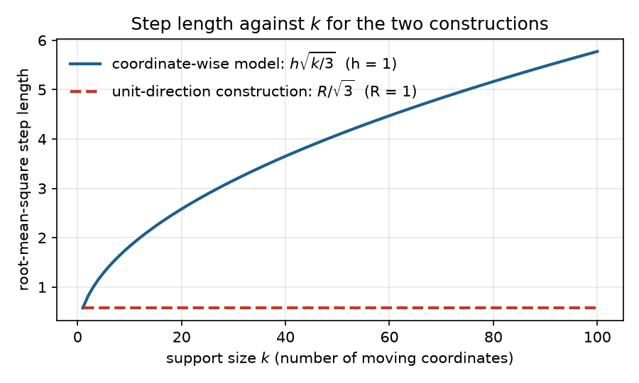
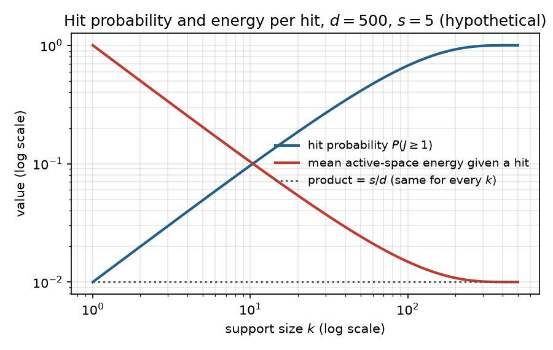

### 6.1 The generator, and what $k$ means

This plan modifies the candidate generator of CTS. Each candidate is the incumbent $c$, the best point found so far, plus a step. CTS builds that step from a direction and a distance that it draws separately:

$$
x = c + r v, \qquad r \sim U(0, R), \qquad \lVert v \rVert_2 = 1,
$$

Here $v$ is a dense unit direction, meaning every coordinate of $v$ may be nonzero, and $r$ is a distance drawn independently of $v$, uniform between 0 and a cap $R$. CTS draws $v$ from a truncated multivariate normal so that a random dense direction does not point into a nearby wall of the domain. It also caps the permissible radius by both the distance to the wall and a trust-region-like $R_{\max}$ (LITERATURE CONTEXT TO VERIFY: the exact construction, Rashidi, Johnstonbaugh & Gao 2024).

RAASP, the perturbation scheme in the original TuRBO implementation, builds a candidate differently. It decides per coordinate whether to perturb that coordinate, with probability $\min(1, 20/d)$, and fills the perturbed coordinates from Sobol points inside the rectangular trust region. For $d \gg 20$, about 20 coordinates move per candidate. There is no separate distance draw: the step length follows from the perturbed coordinates.

The sparse construction studied in this plan sits between the two. Choose a support $S \subseteq \{1, \ldots, d\}$ with $\lvert S \rvert = k$, set $v_i = 0$ for every $i \notin S$, then draw the direction on $S$ and the radius as CTS does. The value of $k$ selects the regime:

- $k = 1$ is a coordinate-like move,
- $1 < k < d$ is a sparse move,
- $k = d$ is ordinary CTS in the interior (§2).

Because the radius is drawn separately, $k$ is an **angular support dimension**: it sets how many coordinates the direction may use, not how far the candidate moves. That is a FACT about the construction, and §6.2 shows why it matters.

### 6.2 Why RAASP's "20" cannot be inherited

The TuRBO value of about 20 moving coordinates is a tempting default for $k$. This section argues that the number belongs to RAASP's construction and does not transfer, because in RAASP the number of moving coordinates also sets the step length.

Take a simplified model of a RAASP-style move: each of the $k$ perturbed coordinates is displaced independently by $\delta_i \sim U(-h, h)$. One coordinate then has mean squared displacement $\mathbb{E}[\delta_i^2] = h^2 / 3$, and the $k$ displacements add up:

$$
\mathbb{E}\lVert \delta \rVert_2^2 = \frac{k h^2}{3},
$$

So the typical step length grows like $\sqrt{k}$. As a hypothetical instance, moving from $k = 5$ to $k = 20$ doubles the root-mean-square step. Increasing $k$ therefore changes two things at once: *how many coordinates move* and *how far the candidate moves*.

This is a FACT about the simplified model, not a claim about every RAASP implementation. Even so, it is one reason sparsity helps RAASP stay local, and it is why the TuRBO value 20 belongs to a sampler in which support size also sets distance.

The unit-direction construction of §6.1 behaves differently. Its step is $\delta = r v$ with $\lVert v \rVert = 1$, so

$$
\lVert \delta \rVert_2 = r
$$

exactly, whatever $k$ is. With $r \sim U(0, R)$ the mean squared step is $R^2 / 3$ for every $k$ (FACT, in the interior). The two controls are separate: $k$ is how many coordinates cooperate in a move, and $r$ is how far the move goes.

*Figure 1. Illustration computed from the two formulas above, not measured data, with $h = 1$ and $R = 1$. The solid line is the root-mean-square step $h\sqrt{k/3}$ of the coordinate-wise model; the dashed line is $R/\sqrt{3}$ for the unit-direction construction. Read left to right: the coordinate-wise step keeps growing with $k$, while the unit-direction step stays flat. The gap between the lines is the distance effect that a coordinate-wise sampler mixes into its choice of support size.*

With distance under separate control, the thread's first HYPOTHESIS can be stated: some of the effect commonly attributed to sparse perturbations is due to the support size itself, rather than to the shorter steps that coordinate-wise sparsity produces. The test is to hold the radial law fixed and sweep $k$. If the differences between support sizes disappear under radial control, the hypothesis is weakened.

### 6.3 What a random support does

A sparse support can miss the coordinates that matter. This section quantifies that risk with a deliberately simple model, then shows that the miss rate is only half of the story.

For analysis only, take an axis-aligned objective that depends on an active set $A$ of coordinates, with $\lvert A \rvert = s$, and let the support $S$ be drawn uniformly among all $k$-subsets of the coordinates. The overlap $J = \lvert S \cap A \rvert$ counts how many active coordinates the support touches. It is hypergeometric:

$$
P(J = j) = \frac{\binom{s}{j} \binom{d - s}{k - j}}{\binom{d}{k}}, \qquad \mathbb{E}[J] = \frac{k s}{d},
$$

The numerator counts the supports with exactly $j$ active and $k - j$ inactive coordinates; the denominator counts all supports of size $k$. For $s, k \ll d$ the chance of touching at least one active coordinate is about $1 - e^{-k s / d}$ (FACT). As a hypothetical instance, with $d = 500$, $s = 5$ and $k = 20$, the expected overlap is $0.2$ and only about 18% of candidates touch any active coordinate at all. This is the familiar argument against very sparse supports, and it is only half the story.

The other half is how much of the direction lands on the active coordinates when the support does touch them. Write $P_A$ for the projection onto the active coordinates, so that $\lVert P_A v \rVert^2$ is the fraction of the direction's squared length that lies in the active subspace; call this the active-space energy. If the direction is isotropic on $S$, meaning equally likely to point anywhere within the support, then conditional on $J = j$ the active-space energy has mean $j / k$: each coordinate in the support carries $1/k$ of the energy on average, and $j$ of them are active. Averaging over supports gives

$$
\mathbb{E}\lVert P_A v \rVert^2 = \mathbb{E}\Big[ \frac{J}{k} \Big] = \frac{s}{d}
$$

for every $k$ (FACT under isotropy). Sparse and dense pools allocate the same *average* fraction of directional energy to an unknown active subspace. The intuition that "smaller $k$ puts more energy into the active coordinates" is therefore false on average.

What changes with $k$ is the *distribution* of that energy across candidates. A dense direction gives every candidate a small active component, of size about $1 / \sqrt{d}$. A sparse direction gives most candidates no active component and the remaining few a component of size about $1 / \sqrt{k}$; at $d = 500$ and $k = 20$ that is a factor 5 larger. Sparse pools therefore trade hit probability, which rises with $k$, for concentration per hit, which rises as $k$ falls.

*Figure 2. Illustration computed from the hypergeometric formula, not measured data, for the hypothetical case $d = 500$, $s = 5$. Both axes are logarithmic. The blue line is the hit probability $P(J \geq 1)$; the red line is the mean active-space energy of a candidate given that it hits, $(s/d) / P(J \geq 1)$; the dotted line is their product, $s/d = 0.01$. Read left to right: as $k$ grows, hits become common but each hit carries less energy, and the product stays flat. The two sloped lines show the trade-off; the flat line is the "same on average" fact.*

The optimizer does not use an average candidate. It takes the best candidate out of a pool of $M$, so what matters is the upper tail of the pool. That makes this an extreme-value question, and the pool size $M$ is part of the answer. HYPOTHESIS: rare strong hits beat ubiquitous weak hits when the pool is large enough and the selector can find them. Step 0 (§4) makes this quantitative under the linear model. The tail diagnostic of Step 3 measures it: the distribution, per $k$, of the active-space displacement $D_A = \lVert P_A (x - c) \rVert$, including its mass at zero and its upper quantiles.
