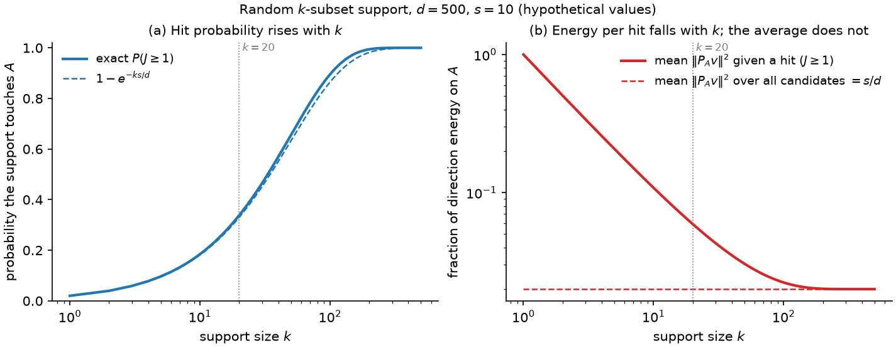

### 6.1 The generator, and what $k$ means

This section defines the candidate generator the study uses and fixes the meaning of its one new parameter, $k$. The sparse construction sits between two existing samplers, so those come first.

**CTS, the dense baseline.** CTS generates a candidate by stepping away from the incumbent $c$, the best point found so far, in a random direction $v$ by a random distance $r$:

$$
x = c + r v, \qquad r \sim U(0, R), \qquad \lVert v \rVert_2 = 1,
$$

The direction $v$ is dense: every coordinate can be non-zero. The distance $r$ is drawn independently of the direction, uniformly between $0$ and a radius $R$. Two details keep candidates away from the edge of the domain. CTS draws $v$ from a truncated multivariate normal, so that a dense random direction does not point into a nearby wall. It also caps the permissible radius by both the wall distance and a trust-region-like $R_{\max}$. (LITERATURE CONTEXT TO VERIFY: the exact construction, Rashidi, Johnstonbaugh & Gao 2024.)

**RAASP, the coordinate-wise alternative.** RAASP works per coordinate rather than per direction. For each of the $d$ coordinates it decides whether to perturb that coordinate, with probability $\min(1, 20/d)$ in the original TuRBO implementation. It then fills the perturbed coordinates from Sobol points inside the rectangular trust region. For $d \gg 20$, about 20 coordinates move in each candidate.

**The sparse construction.** The study's generator keeps the CTS form but restricts the direction to a chosen set of coordinates. Choose a support $S \subseteq \{1, \ldots, d\}$ with $\lvert S \rvert = k$: the coordinates allowed to move. Set $v_i = 0$ for $i \notin S$, then draw the direction on $S$ and the radius $r$ exactly as CTS does. The parameter $k$ spans the whole range:

- $k = 1$ is a coordinate-like move: one coordinate changes.
- $1 < k < d$ is a sparse move.
- $k = d$ is ordinary CTS in the interior (§2).

One point to hold on to for the rest of the plan: $k$ is an **angular support dimension**, not a distance. It says how many coordinates the direction $v$ may use. The distance is set separately by $r$. FACT.

### 6.2 Why RAASP's "20" cannot be inherited

RAASP's $\min(1, 20/d)$ moves about 20 coordinates, so 20 may look like a ready-made value for $k$. It is not, because in a coordinate-wise sampler the number of moving coordinates also sets how far the candidate moves. This section shows that coupling in a simplified model, then shows that the unit-direction construction of §6.1 removes it.

**Coordinate-wise model.** Suppose each of $k$ perturbed coordinates is displaced independently by $\delta_i \sim U(-h, h)$. The mean squared displacement of one coordinate is $\mathbb{E}[\delta_i^2] = h^2 / 3$, and summing over the $k$ moving coordinates gives

$$
\mathbb{E}\lVert \delta \rVert_2^2 = \frac{k h^2}{3},
$$

so the typical step grows like $\sqrt{k}$. With hypothetical numbers $h = 0.1$: moving $k = 5$ coordinates gives a root-mean-square step of about $0.13$, and moving $k = 20$ gives about $0.26$. Increasing $k$ therefore changes *how many coordinates move* and *how far the candidate moves* at the same time.

This is a FACT about the simplified model, not a claim about every RAASP implementation. Even so, it is one reason sparsity helps RAASP stay local: fewer moving coordinates means shorter steps. It is also why the TuRBO value 20 belongs to a sampler in which support size also sets distance. Carrying the number over to a sampler where support size and distance are independent would separate it from the coupling that gave it meaning.

**Unit-direction construction.** For the generator in §6.1, $\delta = r v$ with $\lVert v \rVert = 1$, so

$$
\lVert \delta \rVert_2 = r
$$

exactly. The step length is the radius, whatever $k$ is. With $r \sim U(0, R)$ the mean squared step is $R^2 / 3$ for every $k$ (FACT, in the interior). The two controls are then separate: $k$ is how many coordinates cooperate in a move, and $r$ is how far the move goes.

**HYPOTHESIS (the thread's first).** Some of the effect commonly attributed to sparse perturbations is due to the support size itself, rather than to the shorter steps that coordinate-wise sparsity produces. The test is to hold the radial law, the distribution of $r$, fixed and sweep $k$. If the differences between values of $k$ disappear under radial control, the hypothesis is weakened.

### 6.3 What a random support does

This section asks what a randomly chosen support does when only a few coordinates matter and the sampler does not know which. The first half is the familiar case against sparse supports. The second half shows what that argument leaves out.

**Setting, for analysis only.** Take an axis-aligned objective that depends only on an active set $A$ of coordinates, with $\lvert A \rvert = s$. Draw the support $S$ uniformly among all $k$-subsets of $\{1, \ldots, d\}$, so the choice of $S$ ignores $A$.

**Hit probability.** The overlap $J = \lvert S \cap A \rvert$ counts how many active coordinates the support happens to include. Because the support is $k$ coordinates drawn without replacement, $J$ is hypergeometric:

$$
P(J = j) = \frac{\binom{s}{j} \binom{d - s}{k - j}}{\binom{d}{k}}, \qquad \mathbb{E}[J] = \frac{k s}{d},
$$

and for $s, k \ll d$ the chance of touching at least one active coordinate is about $1 - e^{-k s / d}$ (FACT). With hypothetical values $d = 500$ and $s = 10$: a support of $k = 1$ touches an active coordinate with probability $0.02$, $k = 20$ with probability about $0.34$, and $k = 100$ with probability about $0.9$. This is the familiar argument against very sparse supports: a small $k$ usually misses the coordinates that matter. It is only half the story.

**Energy on the active coordinates.** The other half is how much of the direction lands on $A$ when the support does hit. Write $P_A$ for the projection onto the active coordinates. Then $\lVert P_A v \rVert^2$ is the fraction of the unit direction's squared length, its energy, that lies in the active subspace. If the direction is isotropic on $S$, meaning it is equally likely to point any way within the $k$ chosen coordinates, then conditional on $J = j$ the squared active-space energy has mean $j / k$: each support coordinate carries $1 / k$ of the energy on average, and $j$ of them are active. Averaging over supports, and using $\mathbb{E}[J] = k s / d$ from above, gives

$$
\mathbb{E}\lVert P_A v \rVert^2 = \mathbb{E}\Big[ \frac{J}{k} \Big] = \frac{s}{d}
$$

for every $k$ (FACT under isotropy). Sparse and dense pools therefore allocate the same *average* fraction of directional energy to an unknown active subspace. The intuition that "smaller $k$ puts more energy into the active coordinates" is false on average.

What changes with $k$ is the *distribution* of that energy across candidates. A dense direction gives every candidate a small active component of size about $1 / \sqrt{d}$. A sparse direction gives most candidates no active component at all, and the few that hit get a component of size about $1 / \sqrt{k}$. At $d = 500$ and $k = 20$, the per-hit component is a factor 5 larger than the dense one. Sparse pools therefore trade hit probability, which rises with $k$, for concentration per hit, which rises as $k$ falls. Figure 6.1 shows the two sides of this trade.

*Figure 6.1. Illustration computed from the hypergeometric formulas above, not measured data, for hypothetical values $d = 500$ and $s = 10$; the script is `support_tradeoff_figure.py`. Both panels have the support size $k$ on a log scale. Panel (a): the solid line is the exact probability $P(J \geq 1)$ that the support touches at least one active coordinate; the dashed line is the approximation $1 - e^{-ks/d}$. Read left to right: a larger $k$ hits more often. Panel (b), on a log scale: the dashed line is the mean active-space energy $\mathbb{E}\lVert P_A v \rVert^2 = s / d$ over all candidates, which does not depend on $k$; the solid line is the same mean restricted to candidates that hit, $(s/d) / P(J \geq 1)$. Read left to right: a smaller $k$ concentrates more energy into each hit while the average stays flat. The dotted vertical line marks $k = 20$ for reference against RAASP.*

**Why pool size enters.** The optimizer does not use an average candidate. It takes the best candidate of a pool of $M$, so what matters is the extreme of the pool rather than its mean. This makes the trade an extreme-value question, and the pool size $M$ is part of the answer.

**HYPOTHESIS.** Rare strong hits beat ubiquitous weak hits when the pool is large enough and the selector can find them. Step 0 (§4) makes this quantitative under the linear model. The tail diagnostic of Step 3 measures it: the distribution, per $k$, of the active-space displacement $D_A = \lVert P_A (x - c) \rVert$, with attention to its mass at zero (candidates that missed $A$) and its upper quantiles (the strong hits).
