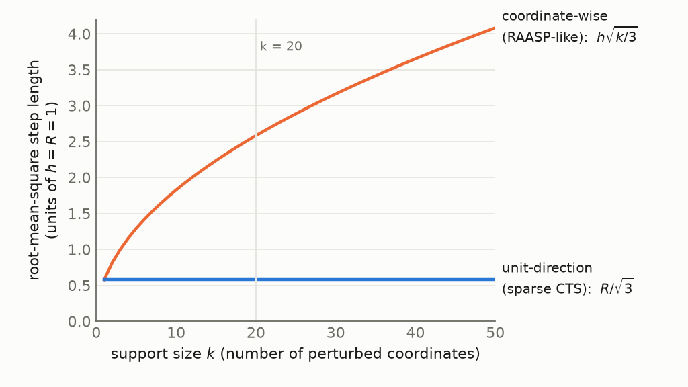
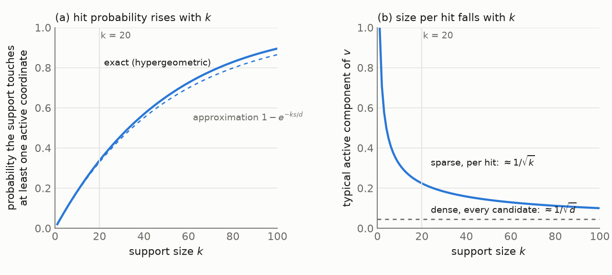

### 6.1 The generator, and what $k$ means

This section defines the candidate generator the study uses and fixes what its one new parameter, $k$, means. The generator sits between two existing samplers, CTS and RAASP, so we describe those first.

CTS generates a candidate $x$ by stepping from the incumbent $c$ (the best point found so far) along a random direction:

$$
x = c + r v, \qquad r \sim U(0, R), \qquad \lVert v \rVert_2 = 1,
$$

Here $v$ is a dense unit-length direction, meaning every coordinate of $v$ can be nonzero, and $r$ is a distance drawn independently of the direction. Because $v$ has unit length, $r$ alone sets how far the candidate moves.

CTS adds two safeguards to this basic step. It draws $v$ from a truncated multivariate normal, so that a dense random direction does not point into a nearby wall of the domain. It also caps the permissible radius by both the distance to the wall and a trust-region-like $R_{\max}$. (LITERATURE CONTEXT TO VERIFY: the exact construction, Rashidi, Johnstonbaugh & Gao 2024.)

RAASP, the sampler in the original TuRBO implementation, works coordinate by coordinate instead. For each coordinate it decides whether to perturb it, with probability $\min(1, 20/d)$ where $d$ is the dimension. It then fills the perturbed coordinates from Sobol points inside the rectangular trust region. For $d \gg 20$ this means about 20 coordinates move per candidate; at $d = 500$, for example, each coordinate moves with probability $0.04$.

The sparse construction combines the two. Choose a support $S \subseteq \{1, \ldots, d\}$ with $\lvert S \rvert = k$, the set of coordinates that are allowed to move. Set $v_i = 0$ for $i \notin S$, then draw the direction on $S$ and the radius $r$ exactly as CTS does. The value of $k$ then selects a regime:

- $k = 1$ is a coordinate-like move: one coordinate changes.
- $1 < k < d$ is a sparse move: a few coordinates change together.
- $k = d$ is ordinary CTS in the interior (§2).

The important point is what $k$ controls. $k$ is an **angular support dimension**: it says how many coordinates the direction $v$ may involve. It is not a distance, because the distance is set separately by $r$. FACT.

### 6.2 Why RAASP's "20" cannot be inherited

The TuRBO value of 20 perturbed coordinates cannot be carried over to the sparse construction, because in RAASP the number of perturbed coordinates also sets how far the candidate moves. In the unit-direction construction it does not. We show this with a simplified model of each sampler.

Suppose, as a simplified model of RAASP, that each of the $k$ perturbed coordinates is displaced independently by $\delta_i \sim U(-h, h)$, where $h$ is the half-width of the per-coordinate move. Then $\mathbb{E}[\delta_i^2] = h^2 / 3$, and the squared length of the whole displacement $\delta$ adds up over the $k$ coordinates:

$$
\mathbb{E}\lVert \delta \rVert_2^2 = \frac{k h^2}{3},
$$

So the typical step grows like $\sqrt{k}$. Increasing $k$ changes *how many coordinates move* and *how far the candidate moves* at the same time. As a hypothetical instance with $h = 1$: $k = 1$ gives a mean squared step of $1/3$, and $k = 20$ gives $20/3$, about 20 times larger.

This is a FACT about the simplified model, not a claim about every RAASP implementation. It still matters for two reasons. It is one reason sparsity helps RAASP stay local: fewer moving coordinates means shorter steps. And it is why the TuRBO value 20 belongs to a sampler in which the support size also sets the distance.

In the unit-direction construction, the displacement is $\delta = r v$ with $\lVert v \rVert = 1$, so its length is

$$
\lVert \delta \rVert_2 = r
$$

exactly. With $r \sim U(0, R)$ the mean squared step is $R^2 / 3$ for every $k$ (FACT, in the interior). In the same hypothetical instance with $R = 1$, the mean squared step is $1/3$ whether $k$ is 1 or 20. The two controls are therefore separate: $k$ is how many coordinates cooperate, and $r$ is how far the move goes.

*Figure 1. Illustration of the two simplified models, not measured data. The horizontal axis is the support size $k$; the vertical axis is the root-mean-square step length with the hypothetical choice $h = R = 1$. The orange curve is the coordinate-wise model, $h\sqrt{k/3}$, and the blue line is the unit-direction model, $R/\sqrt{3}$. Read left to right: the orange curve rises with $k$, so in a RAASP-like sampler a larger support also means a longer step, while the blue line is flat, so in the unit-direction construction the step length does not depend on $k$ at all.*

This separation motivates the thread's first hypothesis.

HYPOTHESIS (the thread's first): some of the effect commonly attributed to sparse perturbations is due to the support size itself, rather than to the shorter steps that coordinate-wise sparsity produces.

The test is to hold the radial law fixed and sweep $k$. Under the unit-direction construction the step length does not change with $k$, so any remaining difference between values of $k$ is due to the support size. If the differences disappear under this radial control, the hypothesis is weakened.

### 6.3 What a random support does

This section asks what a randomly chosen support does when the objective depends on only a few coordinates. The analysis gives two facts. The first is the familiar reason to avoid very sparse supports; the second shows why that reason is only half the story.

Take, for analysis only, an axis-aligned objective that depends on an active set $A$ of coordinates with $\lvert A \rvert = s$. The support $S$ is drawn uniformly among the $k$-subsets of $\{1, \ldots, d\}$, with no knowledge of $A$. The overlap $J = \lvert S \cap A \rvert$ counts how many active coordinates the support happens to include. $J$ is hypergeometric:

$$
P(J = j) = \frac{\binom{s}{j} \binom{d - s}{k - j}}{\binom{d}{k}}, \qquad \mathbb{E}[J] = \frac{k s}{d},
$$

For $s, k \ll d$, the chance of touching at least one active coordinate is about $1 - e^{-k s / d}$ (FACT). As a hypothetical instance, with $d = 500$, $s = 10$, and $k = 20$, we get $\mathbb{E}[J] = 0.4$ and a hit probability of about $1 - e^{-0.4} \approx 0.33$: roughly two candidates in three touch no active coordinate at all. This is the familiar argument against very sparse supports, and it is only half the story.

The other half concerns how much of the direction lands in the active coordinates when a hit happens. Let $P_A$ be the projection onto the active coordinates, so that $\lVert P_A v \rVert^2$ is the **active-space energy** of the direction: the fraction of the unit direction's squared length that lies in the active subspace. If the direction is isotropic on $S$, meaning it is equally likely to point anywhere within the support, then conditional on $J = j$ this energy has mean $j / k$. Averaging over supports gives

$$
\mathbb{E}\lVert P_A v \rVert^2 = \mathbb{E}\Big[ \frac{J}{k} \Big] = \frac{s}{d}
$$

for every $k$ (FACT under isotropy). Sparse and dense pools allocate the same *average* fraction of directional energy to an unknown active subspace. So the statement "smaller $k$ puts more energy into the active coordinates" is false on average.

What changes with $k$ is the *distribution* of that energy across candidates:

- A dense direction gives every candidate a small active component, of size about $1 / \sqrt{d}$.
- A sparse direction gives most candidates no active component and the rest a component of size about $1 / \sqrt{k}$. At $d = 500$ and $k = 20$ this is a factor 5 larger than the dense case.

Sparse pools therefore trade hit probability, which rises with $k$, for concentration per hit, which rises as $k$ falls. Figure 2 shows the two sides of this trade.

*Figure 2. Illustration from the closed-form expressions above at $d = 500$ with a hypothetical active-set size $s = 10$, not measured data. Panel (a): the probability that a random support touches at least one active coordinate, against $k$. The solid curve is the exact hypergeometric value, $1 - P(J = 0)$; the dashed curve is the approximation $1 - e^{-ks/d}$. Panel (b): the typical active component of the direction for a candidate that does hit, about $1/\sqrt{k}$ (solid), compared with the value about $1/\sqrt{d}$ that a dense direction gives every candidate (dashed). Read the two panels together: moving right along $k$ raises the hit probability in (a) but lowers the size per hit in (b). The vertical guide marks $k = 20$, where the per-hit component is about five times the dense value.*

Which side of the trade wins depends on how candidates are selected. The optimizer takes the best candidate of a pool of $M$, so the question is about the largest value in a pool, not the average. This makes it an extreme-value question, and the pool size $M$ is part of the answer.

HYPOTHESIS: rare strong hits beat ubiquitous weak hits when the pool is large enough and the selector can find them.

Step 0 (§4) makes this quantitative under the linear model. The tail diagnostic of Step 3 measures it directly: for each $k$, it records the distribution of the active-space displacement $D_A = \lVert P_A (x - c) \rVert$ of the generated candidates, including its mass at zero (the candidates that miss) and its upper quantiles (the strong hits).
