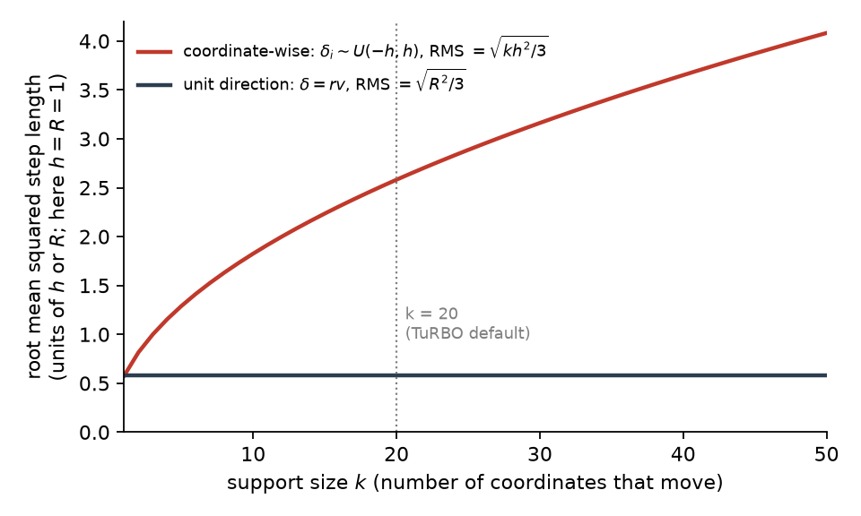
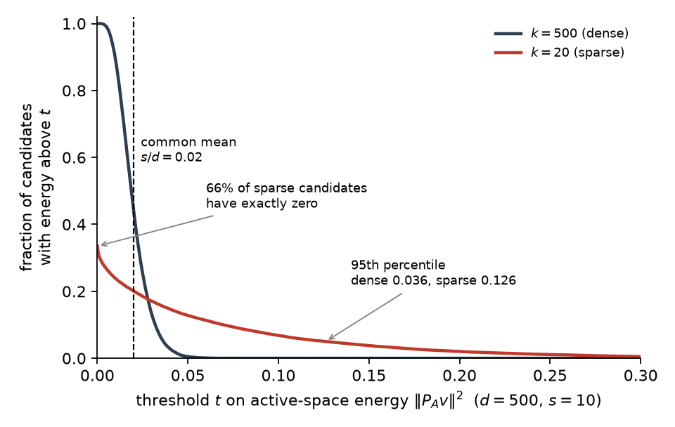

### 6.1 The generator, and what $k$ means

CTS generates each candidate by choosing a direction and a distance separately:

$$
x = c + r v, \qquad r \sim U(0, R), \qquad \lVert v \rVert_2 = 1,
$$

Here $c$ is the incumbent, the best point found so far. $v$ is a unit-length direction, and it is *dense*: every coordinate of $v$ can be nonzero. $r$ is the distance moved along $v$. It is drawn uniformly between $0$ and a radius $R$, independently of $v$.

Two details of the CTS construction matter later. First, CTS draws $v$ from a truncated multivariate normal, so that a random dense direction does not point into a nearby wall of the search box. Second, it caps the permissible radius by both the distance to the wall and a trust-region-like maximum $R_{\max}$. (LITERATURE CONTEXT TO VERIFY: the exact construction, Rashidi, Johnstonbaugh & Gao 2024.)

RAASP, the perturbation scheme used in TuRBO, takes a different route. It decides for each coordinate separately whether to perturb it, with probability $\min(1, 20/d)$ in the original TuRBO implementation. It then fills the perturbed coordinates with values from Sobol points inside the rectangular trust region. For $d \gg 20$, about 20 coordinates move in each candidate.

The sparse construction studied in this plan sits between the two:

1. Choose a **support** $S \subseteq \{1, \ldots, d\}$, the set of coordinates allowed to move, with $\lvert S \rvert = k$.
2. Set $v_i = 0$ for every coordinate $i \notin S$.
3. Draw the direction on $S$ and the radius $r$ as CTS does.

The support size $k$ then spans the range between the two existing schemes. $k = 1$ is a coordinate-like move, $1 < k < d$ is a sparse move, and $k = d$ is ordinary CTS in the interior (§2). FACT: $k$ is an **angular support dimension**, not a distance. It sets how many coordinates the direction uses; it does not set how far the candidate moves.

### 6.2 Why RAASP's "20" cannot be inherited

In a coordinate-wise sampler such as RAASP, the number of perturbed coordinates also sets how far the candidate moves, at least under the simple model below. In the unit-direction construction it does not, so the TuRBO value 20 belongs to a sampler with a different kind of control and cannot simply be carried over.

To see why, take a simplified model of coordinate-wise perturbation: each of the $k$ perturbed coordinates is displaced independently by $\delta_i \sim U(-h, h)$. Then $\mathbb{E}[\delta_i^2] = h^2 / 3$, and the squared length of the whole displacement $\delta$ adds up over the $k$ coordinates:

$$
\mathbb{E}\lVert \delta \rVert_2^2 = \frac{k h^2}{3},
$$

So the typical step grows like $\sqrt{k}$. With hypothetical numbers: holding $h$ fixed and moving from $k = 1$ to $k = 20$ raises the mean squared step from $h^2/3$ to $20h^2/3$, so the typical step is about $\sqrt{20} \approx 4.5$ times longer. Increasing $k$ changes *how many coordinates move* and *how far the candidate moves* at once.

This is a FACT about the simplified model, not a claim about every RAASP implementation. It has two consequences. It is one reason sparsity helps RAASP stay local: fewer perturbed coordinates means shorter steps. And it is why the TuRBO value 20 belongs to a sampler in which the support size also sets the distance.

The unit-direction construction separates the two controls. With $\delta = r v$ and $\lVert v \rVert = 1$,

$$
\lVert \delta \rVert_2 = r
$$

exactly, so with $r \sim U(0, R)$ the mean squared step is $R^2 / 3$ for every $k$ (FACT, in the interior). The two controls are then separate: $k$ is how many coordinates cooperate, and $r$ is how far the move goes.

*Figure 1. Illustration computed from the two formulas above, not measured data. The horizontal axis is the support size $k$. The vertical axis is the root mean squared step length, with $h = R = 1$ so that both curves share units. The red curve is the coordinate-wise model, $\sqrt{k h^2 / 3}$; the dark curve is the unit-direction model, $\sqrt{R^2 / 3}$. Read left to right: the red curve rises with $k$, so in the coordinate-wise model a larger support also means a longer step, while the dark curve is flat, so in the unit-direction model $k$ leaves the step length unchanged. The dotted line marks the TuRBO default of about 20 moving coordinates.*

HYPOTHESIS (the thread's first): some of the effect commonly attributed to sparse perturbations is due to the support size itself, rather than to the shorter steps that coordinate-wise sparsity produces. The test is to hold the radial law fixed and sweep $k$. If the differences between support sizes disappear under radial control, the hypothesis is weakened.

### 6.3 What a random support does

A random support may or may not touch the coordinates that matter, and the support size $k$ controls both how often it does and how much of the direction lands there when it does.

For analysis only, take an axis-aligned objective that depends on an **active set** $A$ of coordinates, with $\lvert A \rvert = s$, and a support $S$ drawn uniformly among all $k$-subsets of $\{1, \ldots, d\}$. The overlap $J = \lvert S \cap A \rvert$ is the number of active coordinates the move touches. It is hypergeometric:

$$
P(J = j) = \frac{\binom{s}{j} \binom{d - s}{k - j}}{\binom{d}{k}}, \qquad \mathbb{E}[J] = \frac{k s}{d},
$$

For $s, k \ll d$, the chance of touching at least one active coordinate is about $1 - e^{-k s / d}$ (FACT). With hypothetical numbers, at $d = 500$, $s = 10$, and $k = 20$ the expected overlap is $0.4$, and the chance of touching any active coordinate is about $1 - e^{-0.4} \approx 0.33$. Roughly two candidates in three move no active coordinate at all. This is the familiar argument against very sparse supports, and it is only half the story.

The other half concerns how much of the direction lands in the active subspace when a hit does occur. Write $P_A$ for the projection onto the active coordinates. Because $v$ has unit length, $\lVert P_A v \rVert^2$ is the fraction of the direction's energy that lies in the active subspace. If the direction is isotropic on $S$ (spread evenly over the $k$ support coordinates), then conditional on $J = j$ this fraction has mean $j / k$, and averaging over supports gives

$$
\mathbb{E}\lVert P_A v \rVert^2 = \mathbb{E}\Big[ \frac{J}{k} \Big] = \frac{s}{d}
$$

for every $k$ (FACT under isotropy). Sparse and dense pools therefore allocate the same *average* fraction of directional energy to an unknown active subspace. The claim "smaller $k$ puts more energy into the active coordinates" is false on average.

What changes with $k$ is the *distribution* of that energy. A dense direction gives every candidate a small active component, of size about $1 / \sqrt{d}$. A sparse direction gives most candidates no active component at all, and gives the rest a component of size about $1 / \sqrt{k}$. At $d = 500$ and $k = 20$, that is a factor 5 larger. Sparse pools trade hit probability, which rises with $k$, for concentration per hit, which rises as $k$ falls.

*Figure 2. Illustration from a simulation of the model in this section (40,000 random supports and isotropic directions at $d = 500$, $s = 10$), not measured optimizer data. The horizontal axis is a threshold $t$ on the active-space energy $\lVert P_A v \rVert^2$. The vertical axis is the fraction of candidates whose energy exceeds $t$. The dark curve is the dense pool ($k = 500$); the red curve is the sparse pool ($k = 20$). Both have the same mean, marked by the dashed line. Compare the two curves at the left edge and in the right tail: the sparse curve starts at about $0.33$ because two thirds of its candidates have exactly zero active energy, but it stays above the dense curve for every threshold beyond about $0.03$, so the sparse pool's best candidates reach active components several times larger than the largest dense candidate.*

The optimizer does not use a typical candidate; it takes the best candidate of a pool of $M$. So this is an extreme-value question: what matters is the upper tail of the pool, and the pool size $M$ is part of the answer.

HYPOTHESIS: rare strong hits beat ubiquitous weak hits when the pool is large enough and the selector can find them. Step 0 (§4) makes this quantitative under the linear model. The tail diagnostic of Step 3 measures it: the distribution of the active-space displacement $D_A = \lVert P_A (x - c) \rVert$ per $k$, with its mass at zero and its upper quantiles.
