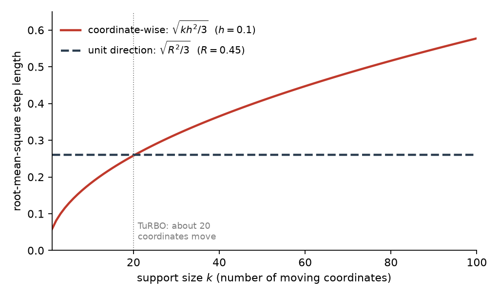
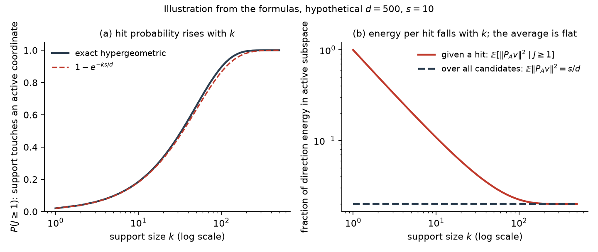

### 6.1 The candidate generator, and what $k$ means

The two existing samplers this plan builds on both start from the incumbent $c$, the best point found so far, and propose candidates near it. They differ in how they choose the direction of a move and how they choose its length.

**CTS**, the dense baseline, generates each candidate by choosing a direction and a distance separately:

$$
x = c + r v, \qquad r \sim U(0, R), \qquad \lVert v \rVert_2 = 1,
$$

Here $v$ is a unit-length direction and $r$ is a distance drawn independently of $v$, uniformly between $0$ and a cap $R$. The direction is *dense*: in general every coordinate of $v$ is nonzero, so every coordinate of the candidate moves. Two details keep candidates inside the box. CTS draws $v$ from a truncated multivariate normal, so that a random dense direction does not point into a nearby wall. It also caps the permissible radius by both the wall distance and a trust-region-like $R_{\max}$. (LITERATURE CONTEXT TO VERIFY: the exact construction, Rashidi, Johnstonbaugh & Gao 2024.)

**RAASP**, the perturbation sampler from TuRBO, works coordinate by coordinate instead. For each coordinate it decides independently whether to perturb it, with probability $\min(1, 20/d)$ in the original TuRBO implementation. It then fills the perturbed coordinates from Sobol points inside the rectangular trust region. For $d \gg 20$, about 20 coordinates move in each candidate.

The **sparse construction** studied here sits between the two. Choose a support $S \subseteq \{1, \ldots, d\}$ with $\lvert S \rvert = k$: the set of coordinates allowed to move. Set $v_i = 0$ for $i \notin S$, then draw the direction on $S$ and the radius $r$ as CTS does. The parameter $k$ therefore spans the range between the two samplers:

- $k = 1$ is a coordinate-like move: a single coordinate changes.
- $1 < k < d$ is a sparse move.
- $k = d$ is ordinary CTS in the interior (§2).

Because $r$ is drawn separately, $k$ says nothing about how far a candidate moves. $k$ is an **angular support dimension**, the number of coordinates the direction $v$ may use, not a distance: FACT.

### 6.2 Why RAASP's "20" cannot be inherited

TuRBO's value of about 20 moving coordinates looks like a natural default for $k$. It does not transfer, because in a coordinate-wise sampler the number of moving coordinates also sets the step length, and in the unit-direction construction it does not.

Take a simplified model of a coordinate-wise sampler. Suppose each of the $k$ perturbed coordinates is displaced independently by $\delta_i \sim U(-h, h)$. A uniform draw on $[-h, h]$ has $\mathbb{E}[\delta_i^2] = h^2 / 3$, and the $k$ independent displacements add up:

$$
\mathbb{E}\lVert \delta \rVert_2^2 = \frac{k h^2}{3},
$$

so the typical step grows like $\sqrt{k}$. (Hypothetical numbers: with $h = 0.1$, moving $k = 4$ coordinates gives a root-mean-square step of about $0.12$, and moving $k = 16$ gives about $0.23$.) Increasing $k$ therefore changes *how many coordinates move* and *how far the candidate moves* at once. That is a FACT about this simplified model, not a claim about every RAASP implementation. But it is one reason sparsity helps RAASP stay local, and it is why the TuRBO value 20 belongs to a sampler in which support size also sets distance.

The unit-direction construction breaks this coupling. Its displacement is $\delta = r v$ with $\lVert v \rVert = 1$, which gives

$$
\lVert \delta \rVert_2 = r
$$

exactly. With $r \sim U(0, R)$, the mean squared step is $R^2 / 3$ for every $k$ (FACT, in the interior). Figure 1 contrasts the two behaviours. The two controls are then separate: $k$ is how many coordinates cooperate, and $r$ is how far the move goes.

*Figure 1. Illustration computed from the two formulas above with hypothetical values $h = 0.1$ and $R = 0.45$; not measured data. The solid curve is the root-mean-square step $\sqrt{k h^2 / 3}$ of the coordinate-wise model, and the dashed line is the root-mean-square step $\sqrt{R^2 / 3}$ of the unit-direction construction. Read left to right: as more coordinates move, the coordinate-wise step keeps growing while the unit-direction step stays constant. The dotted line marks the TuRBO value of about 20 moving coordinates. The crossing point is set by the chosen $R$ and carries no meaning.*

HYPOTHESIS (the thread's first): some of the effect commonly attributed to sparse perturbations is due to the support size itself, rather than to the shorter steps that coordinate-wise sparsity produces. The test is to hold the radial law fixed and sweep $k$. If the differences between values of $k$ disappear under radial control, the hypothesis is weakened.

### 6.3 What a random support does

A random support can miss the coordinates that matter. To see what that costs, take, for analysis only, an axis-aligned objective that depends on an active set $A$ of $\lvert A \rvert = s$ coordinates, and a support $S$ drawn uniformly among the $k$-subsets of $\{1, \ldots, d\}$. The number of active coordinates the support touches, $J = \lvert S \cap A \rvert$, is hypergeometric:

$$
P(J = j) = \frac{\binom{s}{j} \binom{d - s}{k - j}}{\binom{d}{k}}, \qquad \mathbb{E}[J] = \frac{k s}{d},
$$

and for $s, k \ll d$ the chance of touching at least one active coordinate is about $1 - e^{-k s / d}$ (FACT). As a hypothetical instance, with $d = 500$ and $s = 10$, a support of size $k = 20$ touches an active coordinate in about a third of draws ($1 - e^{-0.4} \approx 0.33$), and a support of size $k = 1$ does so in 2% of draws. This is the familiar argument against very sparse supports: a small support usually touches nothing active. It is only half the story.

The other half is how much of the direction lands in the active coordinates when the support does touch them. Write $P_A v$ for the part of $v$ that lies in the active coordinates; since $v$ has unit length, $\lVert P_A v \rVert^2$ is the fraction of the direction's energy spent on the active subspace. If the direction is isotropic on $S$ (no preferred direction within the support), then conditional on $J = j$ this fraction has mean $j / k$: the unit energy is spread evenly over the $k$ support coordinates, and $j$ of them are active. Averaging over supports gives

$$
\mathbb{E}\lVert P_A v \rVert^2 = \mathbb{E}\Big[ \frac{J}{k} \Big] = \frac{s}{d}
$$

for every $k$ (FACT under isotropy). Sparse and dense pools therefore allocate the same *average* fraction of directional energy to an unknown active subspace, so "smaller $k$ puts more energy into the active coordinates" is false on average.

What changes is the *distribution* of that energy across candidates. A dense direction gives every candidate a small active component of size about $1 / \sqrt{d}$. A sparse direction gives most candidates none, and the rest a component of size about $1 / \sqrt{k}$; at $d = 500$, $k = 20$ that is a factor 5 larger. Sparse pools trade hit probability, which rises with $k$, for concentration per hit, which rises as $k$ falls. Figure 2 shows both sides of the trade.

*Figure 2. Illustration computed from the hypergeometric formulas with hypothetical values $d = 500$ and $s = 10$; not measured data. Panel (a): the probability $P(J \geq 1)$ that a random support of size $k$ touches at least one active coordinate, exact (solid) and the approximation $1 - e^{-ks/d}$ (dashed). Panel (b): the fraction of direction energy in the active subspace, averaged over candidates that hit (solid) and over all candidates (dashed), on a log scale. Read both panels left to right: as $k$ grows, hits become more likely in (a) while the energy per hit falls in (b), and the average over all candidates stays at $s / d$ for every $k$. Compare the two solid curves at a given $k$ to see the trade.*

The optimizer does not evaluate an average candidate; it takes the best candidate of a pool of $M$. The question is therefore an extreme-value question, about the best hit in a pool rather than the mean, and the pool size $M$ is part of the answer. HYPOTHESIS: rare strong hits beat ubiquitous weak hits when the pool is large enough and the selector can find them. Step 0 (§4) makes this quantitative under the linear model. The tail diagnostic of Step 3 measures it: the distribution of the active-space displacement $D_A = \lVert P_A (x - c) \rVert$ per $k$, with its mass at zero and its upper quantiles.
